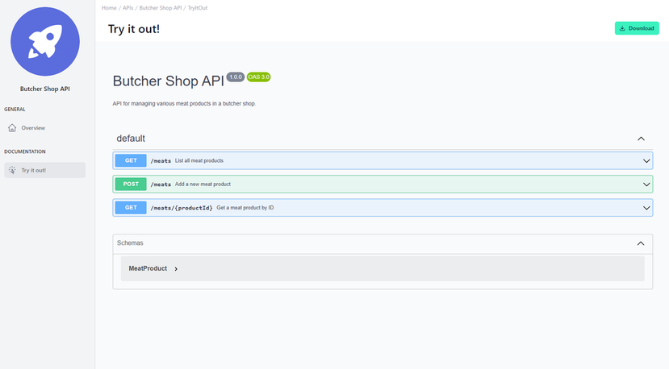

# Try out APIs in Developer Portal 

<head>
  <meta name="guidename" content="API Management"/>
  <meta name="context" content="GUID-ce4f7470-085c-43ac-a0dc-7eab4847270d"/>
</head> 

## Overview

The "Try it out!" page provides an interactive and comprehensive overview of the API's functionalities, making it straightforward to navigate and utilize. Its clear structure and interactive features enhance both its usability and appeal.

The main heading includes the version number "1.0.0" and a tag "OAS 3.0," indicating the API's adherence to the OpenAPI Specification 3.0. A brief description further clarifies the API's purpose, allowing users to quickly understand its functionality.

## Schemas

The "Schemas" section provides a detailed overview of the data structures employed by the API. Upon expansion, it offers a comprehensive view of key attributes relevant to the API, such as the properties and characteristics of its data models.

This context is crucial for understanding how to manage and interact with the API's data, thereby enhancing its usability and making it more straightforward to work with.

## Additional Features

A "Download" button in the top right corner provides quick access to the API’s OpenAPI Specification File, streamlining the onboarding process for developers and users alike.