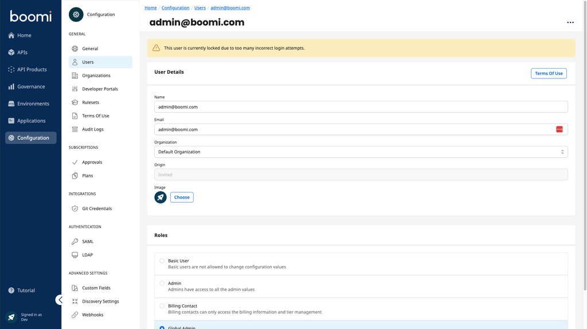

# Unlock User

<head>
  <meta name="guidename" content="API Management"/>
  <meta name="context" content="GUID-5fc4e29d-a0d4-4f4d-bb75-2f9265810591"/>
</head>

## Scenario Description

If you try to log in to the Administration or Developer Portal and enter your password incorrectly five times, your user will be locked. The locked user can only be unlocked by a Global Administrator or by Boomi Support. The blocked user will receive a e-mail notification that the user is now locked.

## Unlock the User

You can identify a locked user by going to the user settings. There you will see a warning at the top of the screen with the message 'This user is currently locked due to too many incorrect login attempts'.

To unlock the user, select the entry 'Unlock User' via the three-dot button at the top right. The user is then unlocked and receives an e-mail notification that they are now unlocked.

