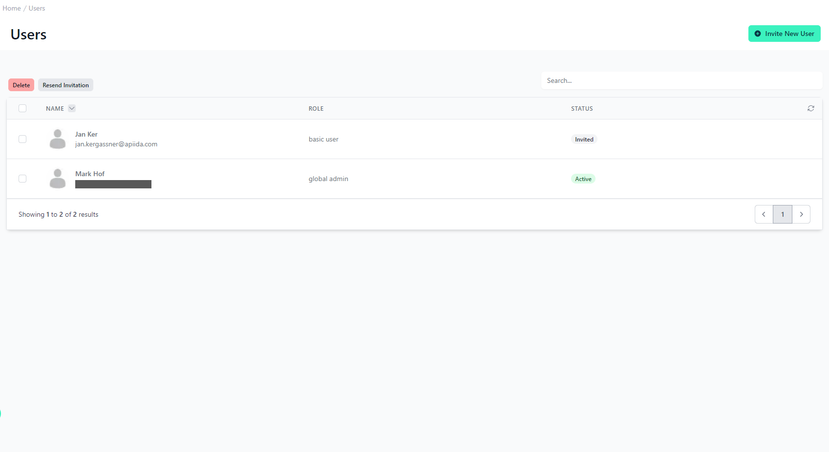
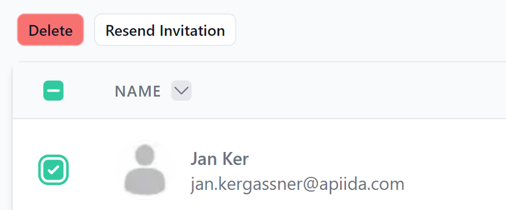
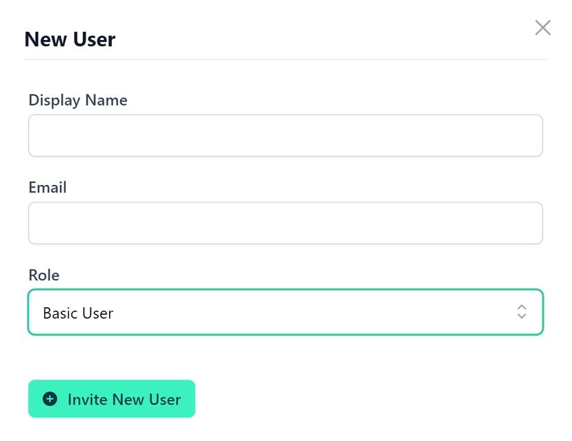

# Users 

<head>
  <meta name="guidename" content="API Management"/>
  <meta name="context" content="GUID-e54425f7-a92d-424c-9eec-234616212f4b"/>
</head> 

## Overview

The "Users" section of the API Control Plane is a simple, user-friendly screen designed for administrators to manage user accounts within the platform. The main feature here is the management of individual user roles and their current status within the API management system.

## User Management
Centered on the page is a table listing user accounts. Each entry in the table provides a snapshot of crucial information: the user's name, email address, role within the system (Admin/ Basic User), and their current status (active/ inactive).

To delete a user or resend an invitation, select one and choose the desired action with the click of a button.

## Adding new Users

Adding new users is easy. Choose a display name, enter the email address, and select a role from the dropdown menu of available roles.

