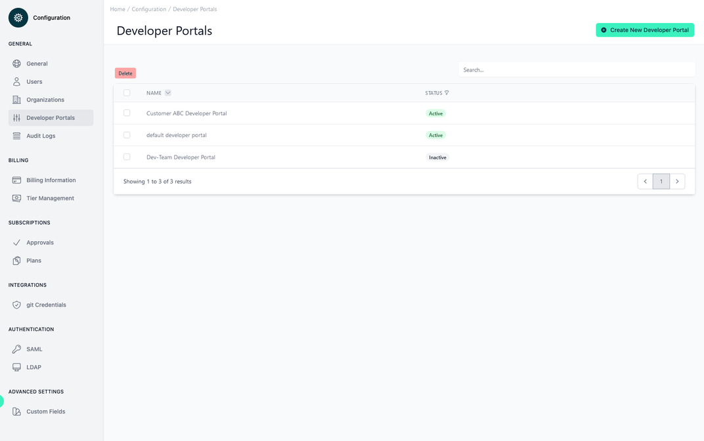
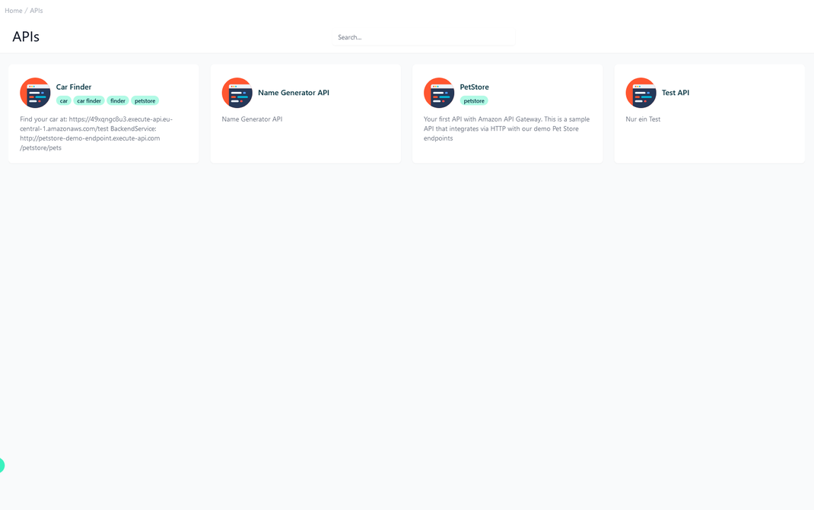
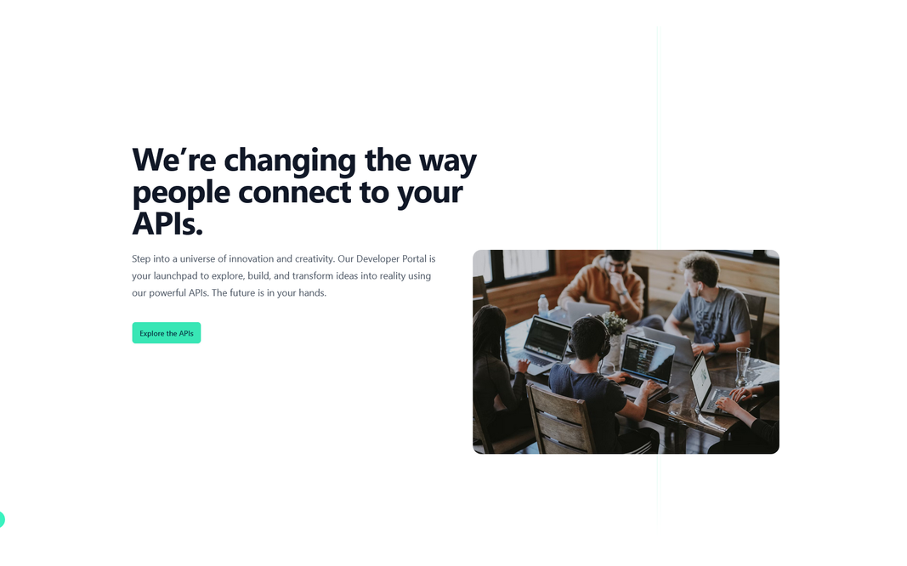

# Configuration Developer Portal

<head>
  <meta name="guidename" content="API Management"/>
  <meta name="context" content="GUID-dafcf332-cc65-4b94-9d1b-7257d31bda04"/>
</head>

To learn more, refer to [Developer Portal](../Topics/cp-Developer_portal_details.md) topic.

## Customization

To make it as easy as possible for you to get started, we provide a base on which you can build. Use our template and customize your Developer Portal according to your own needs.

Visit [Customize your Developer Portal](../Topics/cp-Customize_your_developer_portal.md)

## Multiple Developer Portals

Do you need multiple developer portals for different use cases on which you can publish different APIs? No problem! Link your developer portal to an organization when you set it up.

To learn more, refer to [Host an additional Developer Portal](../Topics/cp-Host_an_additional_developer_portal.md) topic.

## Enable Anonymous Access

To enable anonymous access to the developer portal, head over to Configuration >> Developer Portal. 

As you can see, the guest does not have to log in anymore, but also cannot see all APIs.

More about this in [API Product Visibility](../Topics/cp-API_product_visibility.md).
