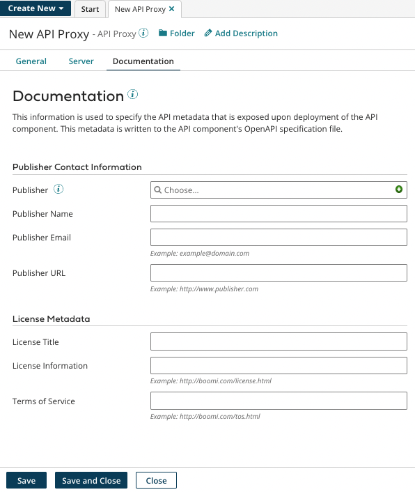

# API Proxy Documentation tab

<head>
  <meta name="guidename" content="API Management"/>
  <meta name="context" content="GUID-12df3948-fb24-4265-81ee-3f10145804fe"/>
</head>

The API Proxy **Documentation** tab is used to specify API metadata exposed upon deployment of the API Proxy component.

:::note

If an OpenAPI specification file is imported into the component, settings on this tab are automatically populated with the value of fields selected for importing as follows:

-   **Publisher Name** is set to the value of the CONTACT\_NAME field.

-   **Publisher Email** is set to the value of the CONTACT\_EMAIL field.

-   **Publisher URL** is set to the value of the CONTACT\_URL field.

-   **License Title** is set to the value of the LICENSE\_NAME field.

-   **License Information** is set to the value of the LICENSE\_URL field.

-   **Terms of Service** is set to the value of the TERMS\_OF\_SERVICE field.

:::
