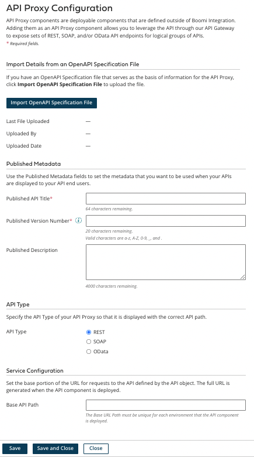

# API Proxy General tab

<head>
  <meta name="guidename" content="API Management"/>
  <meta name="context" content="GUID-b60253f1-9f50-4b46-9bed-33c78c7720de"/>
</head>

The **General** tab is used to define general settings for an API Proxy component.

## Import Details from an OpenAPI Specification File

1. Click **Import OpenAPI Specification File** to open the **Import** wizard. This is used to import the OpenAPI specification file \(3.0 and below are supported\), if available, for use in by the API Gateway for routing requests and as API user documentation in the API Developer Portal. The OpenAPI specification file must be either JSON or YAML.

2. In the wizard’s first screen, select **Import from a file** or **Import from a URL** to determine the import method.

3. Click **Next** to go the next screen. In that screen:

   -   If importing from a file, click **Choose a File** to open a system file selection dialog for selecting the file to upload.

   -   If importing from a URL, the **External Service URL** at which the file resides, and, if needed, the **User Name** and **Password**, are specified.

4. Click **Next** to go the final screen, in which you can select fields for importing.

5. Click **Finish** to run the import request.

Once an OpenAPI specification file is imported into the component, the following information about the file is displayed:

**Name**   
**Description**

**Last File Uploaded**
 The name of the file.

**Uploaded By**
 The user name \(email address\) of the user who imported the file.

**Uploaded Date**
 The date and time at which the file was imported.

## Published Metadata

The following published metadata settings are used to set the metadata that you want to be used when your APIs are displayed to your API end users.

**Name**   
**Description**

**Published API Title**
 Unique name for the API that your API end users see as the API title. If a Swagger specification file is imported into the component and the API\_TITLE field was selected for importing, that field’s value appears here.

**Published Version Number**
 Version number for the API that your API end users see as the API version number. If an OpenAPI specification file is imported into the component and the API\_VERSION field was selected for importing, that field’s value appears here.

**Published Description**
 Description of the API that your API end users see as a description of the API. If a Swagger specification file is imported into the component and the API\_DESCRIPTION field was selected for importing, that field’s value appears here.

## API Type

The selection determines the type of routing on the API Gateway — **REST**, **SOAP**, or **OData**. The path is specified on the API or the Environment configuration in the API Management setup. **REST** is the default.

## Service Configuration

**Name**   
**Description**

**Base API Path**
 Sets the base portion of the URL for requests to the API defined by the API object. The full URL is generated when the API Proxy component is deployed.