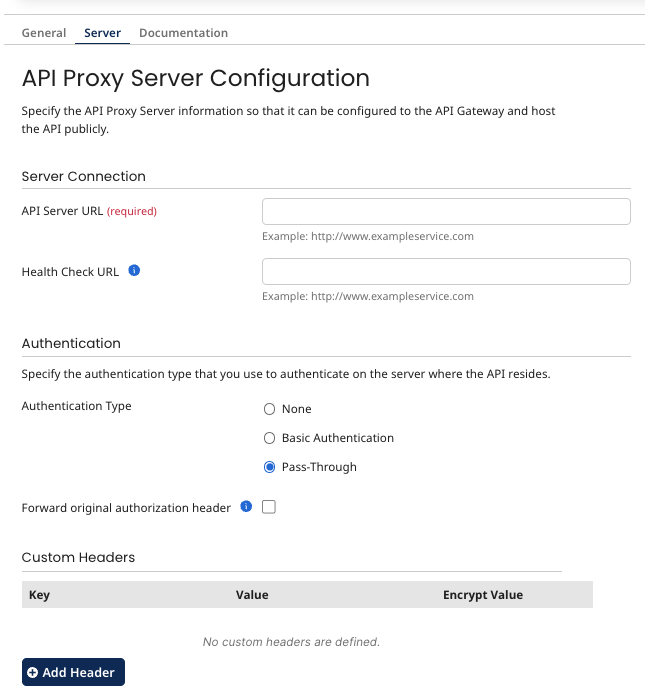

# API Proxy Server tab

<head>
  <meta name="guidename" content="API Management"/>
  <meta name="context" content="GUID-239f0181-44c6-4786-8252-5d08adfea7d6"/>
</head>

Use the **API Proxy Server** tab to define server settings for an API Proxy component.

## Server Connection

**API Server URL**
The URL to which the API Gateway sends API service requests. If a Swagger specification file is imported into the component and the `API\_URL` field was selected for importing, that field’s value appears here.

**Health Check URL**
The URL to which API service heath checks can be sent. An `HTTP 200 \(OK\)` response indicates the server on which the API service is hosted is operating normally.

## Authentication

- **Authentication Type**
The type of authentication used on the server on which the API service is hosted. The following types are available:
  -   **None**
  -   **Basic Authentication** — selecting this authentication type reveals required **User Name** and **Password** fields.
  - **Pass-Through** -  The original authorization header is passed to the target endpoint.

- **Forward original authorization header** - If selected, the original authorization will be forwarded in the `X-Forwarded-Authorization` header.

## Custom Headers

Lists custom headers included by the API Gateway in API service requests. Each custom header consists of a key and value. The value in a custom header can be encrypted.

-   Clicking **Add Header** enables the addition of a custom header.

-   While adding a custom header, clicking **Encrypt** enables the **Password** for an encrypted value to be set.

-   Clicking the **Trash** icon in the Remove column for a listed custom header removes that custom header.