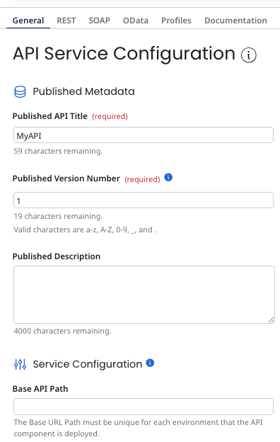

# API Service components

<head>
  <meta name="guidename" content="API Management"/>
  <meta name="context" content="GUID-810F261B-4A65-444E-B436-A36E3F46A3F0"/>
</head>

API Service components are deployable components used to expose sets of REST, SOAP, or OData API endpoints for logical groups of APIs.

:::note

You can build API Service components only while you are using an account where the API Management feature is enabled. If you are using an API Manangement-enabled account, you can deploy API Service components only to Atoms for which **API Type** is set to **Advanced** in the Shared Web Server panel. To have API Management enabled in your account, contact your Boomi sales representative.

:::

By using API Service components, you can expose different sets of endpoints for use by different customers or partners. Like other deployable components, API Service components are versioned.

Each defined endpoint has a linked Web Services Server listener process configured to listen for and process requests for a particular operation on a particular object.

The default settings for an operation specified for an endpoint are derived from the linked process. The defaults can optionally be overridden:

-   For REST and SOAP endpoints, you can set an override for the operation’s input type and, for structured input, the request profile. You can also set an override for the operation’s output type and, for structured output, the response profile.

-   For REST endpoints, you can set an override for the object name and HTTP method.

-   For SOAP endpoints, you can set an override for the operation name.

-   For OData endpoints, you can set an entity name and set an override for the maximum number of documents returned.

A REST endpoint definition consists of a resource and route. A route definition, in addition to its URL path, can optionally specify HTTP header keys and values for requests to match for routing purposes.

Integration automatically generates a WSDL for each deployed SOAP API and an OpenAPI specification file for each deployed REST API.

API Service components are created and configured on the Build page, and then packaged and deployed using Packaged Components in Integration. When you are ready to package and deploy an API Service component, after clicking **Save**, click **Create Packaged Component**. The API Service component closes on the Build page, and focus switches to the Create Packaged Component wizard. After completing the steps, click the **Deploy** button on the final confirmation message. The component now appears in the list of packaged components on the Packaged Components page, and in the list of active deployments on the Deployments page. The Packaged Components and Deployments pages are accessible from the Deploy menu on the service.

:::note

Any user with API Role management privilege \(by default, only administrators\) sees the API Roles section on this tab.

:::

You can define endpoints in an API Service component by adding them individually and linking processes or you can use the Add Processes wizard to generate endpoints.

:::note

You cannot save an API Service component if there is a deployed API with the same **Base API Path**. 

:::

## Import endpoints

Clicking **Import an Endpoint** in an API Service component opens the Add Processes wizard, which you can use to generate the component’s REST, SOAP, or OData endpoints. The wizard supports these methods of generating endpoints:

-   Select existing processes and generate the endpoints to which the processes are linked.

-   Simultaneously generate both a process and endpoints to which the process is linked.

-   Import a WSDL or OpenAPI specification file for an external SOAP- or REST-based API. Simultaneously generate processes and SOAP or REST endpoints to which the processes are linked to serve as proxies for operations enabled by that API.

The WSDL SOAP binding must be in the document style and have a literal use — that is, the Document/literal style/use model; WSDLs whose bindings are in [other style/use models](http://www.ibm.com/developerworks/library/ws-whichwsdl/) are not supported. WSDLs containing element definitions having the form attribute with a value of “unqualified” are also not supported. 