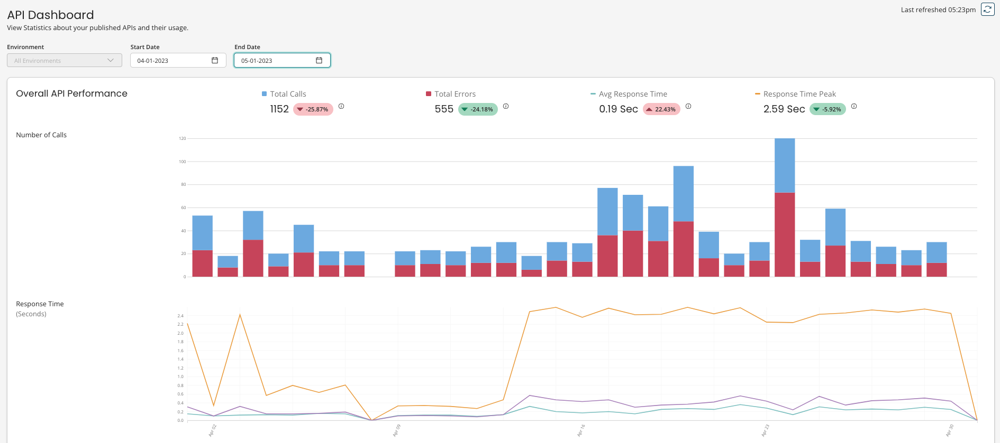
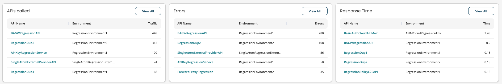
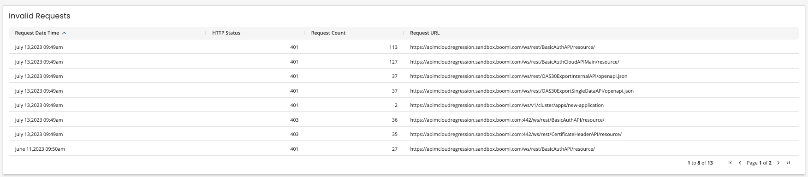

# Dashboard 

<head>
  <meta name="guidename" content="API Management"/>
  <meta name="context" content="GUID-8AECECF1-073A-4C4E-891A-0E6ECC4D5707"/>
</head>

The **Dashboard** link in the API Management menu opens the API Dashboard page. The dashboard allows you to gain insights into API performance by tracking usage, viewing error rates, and assessing response times.

:::note 

If the **API Metrics and Dashboard** [feature](/docs/Atomsphere/Platform/int-Account_features_page_2f7d9196-e800-4f11-8cf9-9a2a3f06549c.md) is enabled, this enhanced dashboard is available. If this feature is not enabled, API usage data is available in the [Legacy Dashboard](/docs/Atomsphere/API%20Management/Topics/api-Legacy_Dashboard_b90b63e6-88cc-40da-b01f-33cd2566fe46.md).

:::

## Overall API Performance 

The data in the graphs is based on the selected environment and date range. You can view API statistics for all environments or for a specific environment. The default date range is the current date and you can also use the **Select Date Range** option.

:::note 

If the current date is set for the start and end date, note that it will display data from 12am to the current time.

:::

Total calls, total errors, average response time, and response time peak figures are presented with a percentage that compares to the previous time period. If you are viewing seven days of data, the previous period would be the preceding seven days.

:::note 

The dashboard's **Environment** filter only supports requests from May 1, 2023. See the [Legacy dashboard](/docs/Atomsphere/API%20Management/Topics/api-Legacy_Dashboard_b90b63e6-88cc-40da-b01f-33cd2566fe46.md) for data before May 1, 2023.

:::

The following information is available:

-   **Number of Calls** - The number of successful calls \(displayed in blue\) and errors \(displayed in red\).
-   **Response Time** - **Average Response**, **Peak**, and **Standard Deviation** in seconds.

## APIs called 

The table displays the top five called APIs. You can also view all APIs and the statistics for each. **Call Logs** and **Error Logs** are available for each API.

-   **Call Logs** and **Error Logs** provide the following statistics for each API call - **Request Date**, **Gateway**, **Application Name**, **Request URL**, **HTTP Method**, **HTTP Status**, **Response Duration**, **Bytes Received**, **Bytes Sent**, **Quota Count**, **Quota Reset**, **Rate Reset**, **Remote Address**, **Execution ID**.

## Errors 

The table displays five APIs with the highest amount of errors. You can also view all APIs and the statistics for each.

## Response Time 

The table displays five APIs with the longest response time. You can also view all APIs and the statistics for each.

## Invalid Requests 

The table displays the **HTTP Status**, **Request Count**, **Request URL**, and the **Request Date Time** for invalid requests.