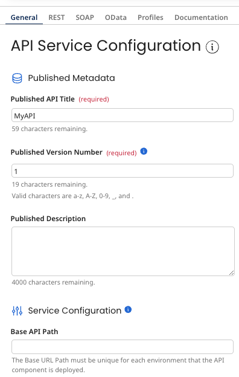

# API Service General tab

<head>
  <meta name="guidename" content="API Management"/>
  <meta name="context" content="GUID-4578ae0d-4be1-4dad-bc57-e383542ea897"/>
</head>

The **General** tab is used to define general settings for an API Service component.

## Published Metadata

The following published metadata settings are used to set the metadata that you want to be used when your APIs are displayed to your API end users.

**Published API Title**
Unique name for the API that your API end users see as the API title.

**Published Version Number**
Version number for the API that your API end users see as the API version number.

**Published Description**
Description of the API that your API end users see as a description of the API.

## Service Configuration
The following service configuration settings are related to viewing and restricting access to published APIs.

**Base API Path**
Sets the base portion of the URL for requests to the API defined by the API object. The full URL is generated when the API Service component is deployed.

**Restrict API Access**
Restricting API access through the API Service component is deprecated. Remove API roles created in and create new API roles to manage API access in API Management.

## Dynamic Document Property Headers

The controls in this section are used to configure the list of the names of Dynamic Document Property Headers whose values in REST and SOAP requests are potentially passed to the API’s linked listener process execution as dynamic document properties. HTTP Headers listed as protected in the Atom's shared web server configuration are not passed into the process, even if specified in the Dynamic Document Property Headers section.

The dynamic document property name assigned to each passed value has the prefix `inheader_` — for example, `inheader_Content-Type` is the dynamic document property name for the value of the standard HTTP header `Content-Type`. Incoming HTTP Headers with the special prefix "X-WSS-" automatically pass into the process and do not need to be specified in Dynamic Document Property Headers.

**Add Header**
Adds a field to the Header Name list for specifying a header name.

**Header Name**
Lists the specified header names. Each list entry has an editable field in which the name of a header is specified — either one of the following [standard HTTP headers](https://en.wikipedia.org/wiki/List_of_HTTP_header_fields#Request_fields) or a “custom” header.

| Request Headers | Entity Headers                                                |
|-----------------|---------------------------------------------------------------|
|                 |                                                               |
| Accept          | Content-Encoding — the compression method applied to the data |
| Accept-Charset  | Content-Language                                              |
| Accept-Encoding | Content-MD5                                                   |
| Accept-Language | Content-Type — the MIME type of any input data, if given      |

Header names can contain alphanumeric characters and special characters !\#$%&'\*+.^\`~-\_. Standard HTTP header field names are case-sensitive.

Clicking  next to a header name removes that header name from the list.
