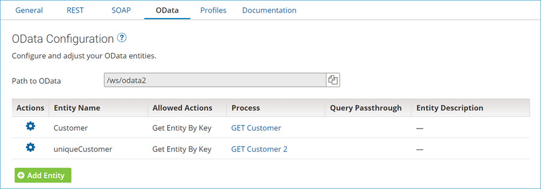

# API Service OData tab

<head>
  <meta name="guidename" content="API Management"/>
  <meta name="context" content="GUID-17659F8A-197E-4705-A18C-E0E6CB4FBD43"/>
</head>

The API Service **OData** tab is used to configure the API service’s OData API and to generate and configure its OData entities. If you do not have any OData entities defined, you are prompted to create one.

:::note

You can generate endpoints from processes by clicking **Import an Endpoint** in the component and selecting the processes. The default settings for the specified operations are derived from the process’s Web Services Server connector’s Listen action.

:::

## OData entities

The root of the profile is an entity type that must have at least one simple child element that can be used for a key. The key can only be an integer data type.

**Name**   
**Description**

**Path to OData**  
Shows the relative path for the OData entity that is pulled into the complete path \(along with the **Base API Path** from the General tab\) when the web server is deployed to an Atom. The Atom provides the base URL.

**Actions**   
Click on the ** Actions** icon to either edit or delete the entity.

**Allowed Actions**   
These OData actions are available for each entity:

-   Get Entities

-   Get Entity By Key

**Process**   
Shows the Web Services Server listener process linked to this entity.

**Query Passthrough**   
For Get Entities Action, OData client processes pass query filters as payloads in requests for the action when selected.

**Entity Description**   
Description of the OData entity. 