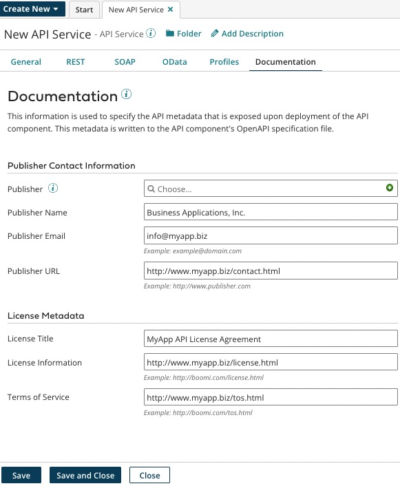

# API Service Documentation tab

<head>
  <meta name="guidename" content="API Management"/>
  <meta name="context" content="GUID-1E61E7F6-7F54-4BC7-B19E-C8497F6EC2FC"/>
</head>

The API Service **Documentation** tab is used to specify API metadata exposed upon deployment of the API Service component. This metadata is written to the API Service component’s OpenAPI specification file. If you are using the component with , the metadata is also visible in the Developer Portal.

