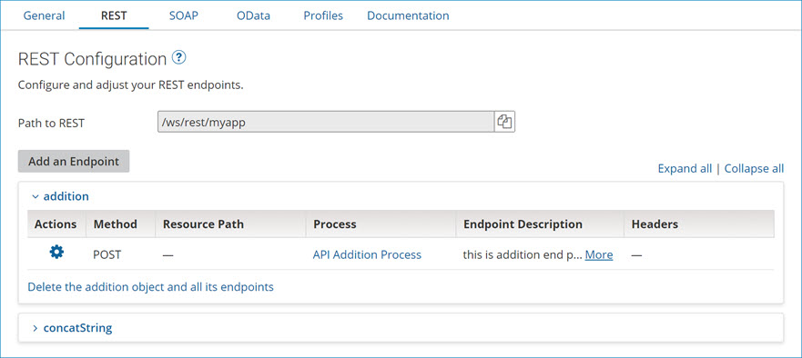

# API Service REST tab

<head>
  <meta name="guidename" content="API Management"/>
  <meta name="context" content="GUID-907B3C67-DA25-4D37-8B7C-BD21B1B7A7C4"/>
</head>

The API Service REST tab is used to generate and configure the API service’s REST endpoints. Endpoints consist of a resource, which identifies an object, and a route, which specifies an operation performed on the object. Resources have one or more associated routes. If you do not have any REST endpoints defined, you are prompted to create one.

:::note

You can generate endpoints from processes by clicking Import an Endpoint in the component and selecting the processes. The default settings for the specified operations are derived from the process’s Web Services Server connector’s Listen action.

:::

## REST endpoints

Resources are listed by object name. Routes are listed by HTTP method, URL path, and HTTP headers, the latter as comma-delineated key-value pairs. If the list entry for a route is truncated due to lack of space, pausing the pointer on the entry displays it in its entirety. Selecting a route enables the controls to the right for configuring the operation specified for the route.

For each item in the list there is an  Actions menu:

- **Path to REST**

  Shows the relative path for the REST endpoints that is pulled into the complete path (along with the Base API Path from the General tab) when the web server is deployed to an Atom. The Atom provides the base URL.

- **Action**

  Click on the  Actions icon to either edit or delete the endpoint or copy it to SOAP or OData.

- **HTTP Method**

  Shows the HTTP method used in requests for the operation specified in the route.
  
  - GET — GET or QUERY operation.
  - POST — CREATE, EXECUTE or UPSERT operation.
  - PUT — UPDATE operation.
  - DELETE — DELETE operation.
  - PATCH — PATCH operation.

  :::note
  
  The HTTP method used for an incoming REST request is available to the listener process execution as the dynamic process property `inmethod`.

  :::

- **Resource Path**

  Shows the resource path for requests for the operation specified in the route. The Resource Path consists of two fields: Object Name and Path Parameters.
  
- **Object Name**
  
  Specified for when requests are made to the specified operation.
  
- **Path Parameters**

Braces `{}` in the path, for example `{id}`, delineate the names of parameters. Parameters in the matched part of the path are available to the linked process as dynamic process properties named `param_name`, where name is the parameter name, for example `param_id`. The full URL has this form:`http://Host:port/REST_url_path/Object/Path_Parameters`

where:
- `Host` and `port` are set in the Shared Web Server panel (Manage > Atom Management).
- `REST_url_path` is the Path to REST (this path contains the Base URL specified in the General tab),
- `Object/Path_Parameters` is this setting.

For example:
`http://machine.domain.tld:9090/ws/rest/Customer/{customerId}`

For a set of routes for a given object with HTTP Method GET, the following URL Path usage is typical:

| HTTP Method and URL Path | Usage                                                                                                                                                     |
|--------------------------|-----------------------------------------------------------------------------------------------------------------------------------------------------------|
|                          |                                                                                                                                                           |
| `GET /`                    | Return all instances of the object.                                                                                                                       |
| `GET /{id}`                | Return the instance of the object having as its ID the specified id parameter value.                                                                      |
| `GET /{id}/metadata`       | Return metadata for the instance of the object having as its ID the specified id parameter value.                                                         |
| `GET /{id}/{fieldName}`    | Return the value of the field specified as the fieldName parameter value in the instance of the object having as its ID the specified id parameter value. |

You are not required to set the **Resource Path**. If you leave the **Resource Path** empty, the resource path is the default operation from the **Base API Path**. The Base API Path is set in the Service Configuration section on the **General** tab of the API Service component.

- **Process**

  Shows the Web Services Server listener process linked to this endpoint:
  - Clicking the magnifying glass icon opens the component browser for selecting the process.
  
  - Clicking the edit icon opens the currently selected process for editing.

- **Endpoint Description**

  Description of the REST endpoint.

- **Headers**

  Shows the defined HTTP headers for requests for the operation. The headers in a request are evaluated for routing purposes in the same manner as static URL path components.
  
  The header name is either a [standard HTTP header](http://www.w3.org/Protocols/rfc2616/rfc2616-sec4.html#sec4.2) or a “custom” header.
  