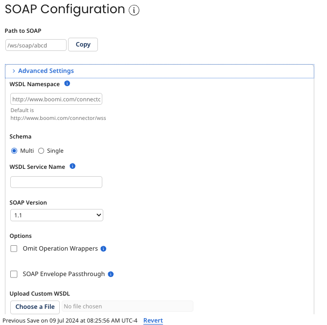

# API Service SOAP tab

<head>
  <meta name="guidename" content="API Management"/>
  <meta name="context" content="GUID-2b9d1c7a-a2ed-48e8-ad87-8ca86b3ce247"/>
</head>

The API Service **SOAP** tab is used to configure the API service’s SOAP API and to generate and configure its SOAP operations. If you do not have any SOAP operations defined, you are prompted to create one.

**Name**   
**Description**

**Path to SOAP**   
Shows the relative path for the SOAP operations that is pulled into the complete path \(along with the **Base API Path** from the General tab\) when the web server is deployed to an Atom. The Atom provides the base URL.

:::note

Endpoints can be generated from processes by clicking **Import an Endpoint** in the component and selecting the processes. The default settings for the specified operations are derived from the process’ Web Services Server connector’s Listen action.

:::

## SOAP advanced settings

The following advanced settings are related to the SOAP API’s WSDL, which is automatically generated and defines the required structure for all SOAP requests and responses.

**Name**   
**Description**

**WSDL Namespace**   
Identifies the unique namespace identifier that is applied as a prefix in the WSDL to object names and list nodes.

**Schema**   
-   Single — schemas are embedded in the WSDL.

-   Multi — a schema file is generated for each XML namespace. Schema files are linked from the WSDL or another schema file.

**WSDL Service Name**   
The WSDL service name affects the `<port\>` and `<binding\>` elements in the WSDL.

It is typically unnecessary to set a custom value unless you have a requirement to mimic a pre-existing API.

**SOAP Version**   
Sets the SOAP version compatibility for the WSDL:

-   1.1 (default) — the WSDL is compatible with SOAP v1.1.

-   1.2 — the WSDL is compatible with SOAP v1.2.

-   1.1 and 1.2 — the WSDL is compatible with both SOAP v1.1 and v1.2.

**Omit Operation Wrappers**   
If specified, the WSDL omits -specific operation name wrapper elements for requests and responses. This setting is off by default, and Boomi adds a wrapper around the profile object to identify the operation.

A standard operation structure is expected to be `<operationName><ProfileObject>` `content of ProfileObject` `</ProfileObject></operationName>`. If the profile root node already describes the operation, which is especially true when the root node is interacting with pre-existing third-party APIs, the default `<operationName>` wrapper should be omitted.

This option cannot be used with operations for which the input type is Multiple XML objects. This option cannot be used unless operation names match the names of their corresponding profile elements.

**SOAP Envelope Passthrough**   
If specified, the entire SOAP request is passed into the process. If not specified, only the SOAP body section is passed into the process.

Use this option for examining the entire SOAP request or for processing SOAP header values within a Boomi process. For example, the SOAP header WS-Security can be called in a process when SOAP Envelope Passthrough is specified.

:::note

Advanced SOAP functionality is an optional account feature. If you would like to have this feature enabled in your account, contact your Boomi representative.

:::

**Upload Custom WSDL**   
Allows you to override the generated WSDL with one that provides different namespaces than the auto-generated ones. This is particularly important if clients of your web service are expecting the namespaces in a specific format different than the Boomi-generated ones.

If you choose to upload a custom WSDL, the uploaded file is returned exactly as indicated so that you have a seamless match to the original. You are required to update the WSDL in order to show new objects that you have added or to remove objects that you have deleted.

With a custom WSDL, it is your responsibility to match all operations and processes to the uploaded WSDL.

## SOAP operations

Operations are listed by operation name. Selecting an operation enables the controls to the right for configuring the operation specified for the endpoint.

**Name**   
**Description**

**Action**   
Click on the ** Action** icon to either edit or delete the operation or copy it to REST.

**Operation Name**   
-   When a process is linked to an endpoint, the operation name is derived by default from the process as follows: The listener operation’s type is concatenated to the name of the object — for example, getCustomer. The derived operation name appears in gray.

-   If the endpoint is not linked to a process, the operation name is set by default, as an override, to operationNameX, where X is a sequentially assigned numeric character(s).

Typing an operation name overrides the default. If an override is set, the operation name appears in black.

If the Pure SOAP Passthrough option is selected, the operation name must match the name of the corresponding profile element.

**Process**   
Shows the Web Services Server listener process linked to this operation.

**Operation Description**   
Description of the SOAP operation.

## Operation configuration

Properties of the selected endpoint’s specified operation are configurable.

:::note

When a process is linked or edits are applied to a linked process, the settings for the operation are updated to match the process’ Web Services Server connector’s Listen action, thereby negating previously set overrides.

:::

:::note

To update the endpoints list to reflect operation configuration changes, you must **Save** the component.

:::