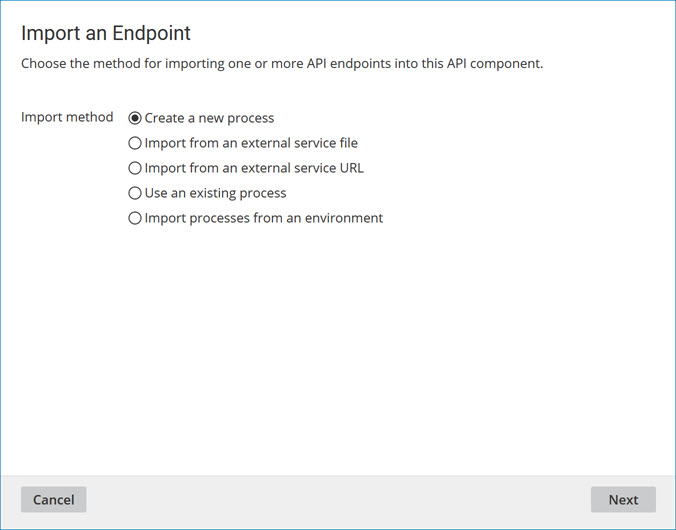

# Import endpoints

<head>
  <meta name="guidename" content="API Management"/>
  <meta name="context" content="GUID-C5B95C2A-59F4-415A-9025-982B5AFECBA8"/>
</head>

Clicking **Import an Endpoint** in an API Service component opens the Import an Endpoint wizard, which can be used to generate REST, SOAP, or OData endpoints for the component.

In the wizard’s first screen, **Add Processes**, you select the method by which to generate endpoints.

**Method**   
**Description**

**Create a new process**   
Generate an endpoint with a new linked process by configuring the process’ Web Services Server operation.

**Import from an external service file**   
Generate SOAP and REST endpoints with corresponding linked processes as proxies for external web service requests from a local file.

:::caution

When importing an API endpoint from an OpenAPI Specification file, JSON profiles can have a maximum of 5,000 nodes, 10,000 anonymous or defined complex types, and two levels of recurrence. However, users can manually add additional nodes, types, and levels beyond these limits as needed after the initial profile generation.

:::

**Import from an external service URL**   
Generate SOAP and REST endpoints with corresponding linked processes as proxies for external web service requests from a URL.

:::caution

When importing an API endpoint from an OpenAPI Specification file, JSON profiles can have a maximum of 5,000 nodes, 10,000 anonymous or defined complex types, and two levels of recurrence. However, users can manually add additional nodes, types, and levels beyond these limits as needed after the initial profile generation.

:::

**Use an existing process**   
Select a process to link to a new endpoint.

**Import processes from an environment/Atom**   
Select one or more processes deployed to a specified environment or Atom to link to a new endpoint.

**Cancel**   
Closes the wizard without generating endpoints.

**Next**   
Advances the wizard to the next screen — either **Create a Process**, **Import Process from an External Service**, Use an Existing Process, Import Processes from an Environment, or Import Processes from an Atom. 