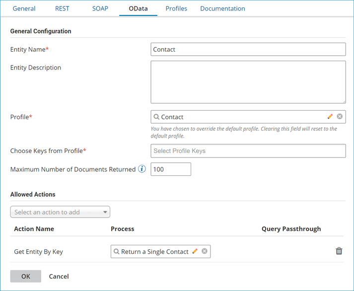

# OData API endpoint URIs

<head>
  <meta name="guidename" content="API Management"/>
  <meta name="context" content="GUID-eacc86d6-9ceb-4388-9f5e-a47c24fa2412"/>
</head>

When your API Service component uses OData as the protocol, your OData URI has three components: a service root URI, a resource path, and query options.

-   The service root URI identifies the root of an OData service.
-   The resource path identifies the resource to be interacted with and enables the data model \(i.e. your profile\). The resource path is composed of entities, which have these characteristics:

    -   A collection name for sets of entity types, such as products, categories, or suppliers.
    -   A name that is different from the name of the set.

    -   A primitive or complex property type. Primitive types consist of a named or typed property and a key. Complex types are containers and do not have keys.

    -   A namespace — OData does not support the Empty Namespace like XML does. Because System, Transient, and Edm are reserved, you cannot publish entities on those namespaces.

-   System Query Options control the amount and order of data that an OData service returns. The supported options are:

    -   $orderby — in collections this option specifies the values to use to order the entries.

    -   $top — identifies a subset by selecting only the first N items of the set. If the $top option is set to a value greater than that in **Maximum Number of Documents Returned**, only the value of Maximum Number of Documents Returned will be returned, along with the moreDataToken.

    -   $skip — identifies a subset by seeking N entries into a collection, then selecting only the remaining entries. For example, when entry N=500, entries 501 and higher are returned.

    -   $filter — identifies a subset by selecting only entries that satisfy the specified predicate expression. Expressions can be properties and literals. Literal values can be strings within single quotes, numbers, or boolean values.

        :::note
    
        If a Get Entity action with the **Query Passthrough** option is specified for an entity, query filtering is applied within the listener process linked to the action. The option does not support all $filter operators and methods. For more information about the Query Passthrough option, see the linked topic.

        :::

    -   $select — identifies a value that specifies a response.

    -   $inlinecount — specifies that the response include a count of the number of entries in the collection.

If the URI contains a $top or $skip query option but not an $orderby option, then the entries in the set are first fully ordered by the data service.

If a URI contains an $inlinecount and a $filter query option, you must apply $filter first.

