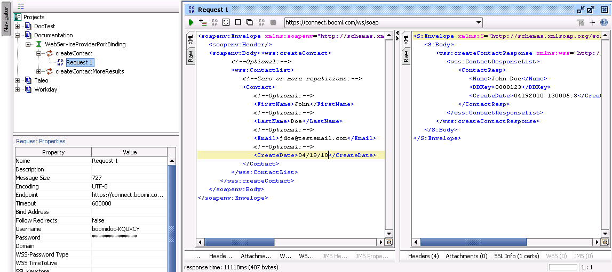

# Building a SOAP request in SoapUI

<head>
  <meta name="guidename" content="API Management"/>
  <meta name="context" content="GUID-feccb0f8-8770-4761-939a-be243e8fa225"/>
</head>

In SoapUI, build a SOAP request by editing the request to include your information.

## Procedure

1.  Collapse one of the requests in your project list and right-click **Request 1**.

2.  Select **Show Request Editor** from the list.

3.  Edit the SOAP request as required and enter sample data where there are question marks.

4.  If you are using BASIC authentication or are connecting to a Atom Cloud or Test atom Cloud. Enter your AccountID and the Atom's authentication token in the Username and Password fields in the Request Properties section.

5.  Click the green arrow button in the top left corner of the request editor to send the request to the endpoint URL.

6.  Review the response window on the right to see messages returned from the web server.

7.  **Optional:** Consider adjusting the timeout parameter \(in milliseconds\) if you need the client to wait longer for responses.

    
    