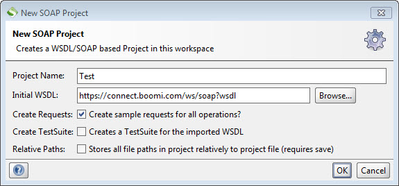

# Building a SoapUI project

<head>
  <meta name="guidename" content="API Management"/>
  <meta name="context" content="GUID-1a843875-b4dd-4324-b7c9-70ac707f7fed"/>
</head>

Using SoapUI, you can test APIs by pointing to the WSDL URL.

## Procedure

1.  Select **File** \> **New SOAP Project**.

    The New SOAP Project dialog opens.

2.  In the **Project Name** field, type a project name.

3.  In the **Initial WSDL** field, type or paste the WSDL URL that points to the Atom web server URL or the domain name for a  Atom Cloud or Test Atom Cloud.

    :::info
    
    Ensure that you have a process deployed to the Atom that contains a Web Services Server connector.

    :::

4.  Turn on the **Create sample requests for all operations?** check box.

    

5.  Click **OK**.

6.  If you are using BASIC authentication or are connecting to a Atom Cloud or Test Atom Cloud, enter your AccountID and the Atom's authentication token \(see the topic Configuring Web Service Listen Connections\) and click **OK**.

    At this point, all web service request operations from the Atom's web server will load into your SoapUI project.
    