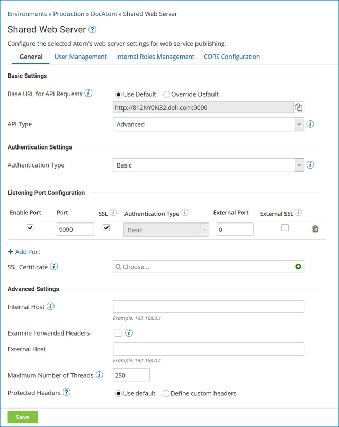

# Enabling an Atom, Molecule, or Atom Cloud for use with an API Service component

<head>
  <meta name="guidename" content="API Management"/>
  <meta name="context" content="GUID-65d9f408-5610-4c68-a807-df4957b4cb90"/>
</head>

Use the **Shared Web Server** panel within Atom Management to set the **API Type** to Advanced.

## Before you begin

You must have the Atom Management privilege to perform this task. If you have the Atom Management Read Access privilege, you cannot perform the task.

The API Management feature must first be enabled for the account that owns the Atom, Molecule, or Atom Cloud.

## Procedure

1.  In the **Manage** menu select **Atom Management**.

2.  Select the Atom, Molecule, or Cloud from the list on the left.

3.  In Settings & Configuration, click **Shared Web Server**.

    The Shared Web Server panel opens.

    

4.  In the **API Type** list, select Advanced.

5.  Click **Save**. 