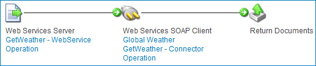

# Generating API endpoints in an API Service component as proxies for external API operations

<head>
  <meta name="guidename" content="API Management"/>
  <meta name="context" content="GUID-9a5c85ad-8ae0-40e8-93a7-902058a913cd"/>
</head>

Generate an API endpoint as a proxy for an external operation by selecting **Import from an external service file** in the **Import an Endpoint** wizard on the API Service component page.

## Before you begin

Before you can generate API endpoints as proxies for operations of an external API, complete the following steps:

-   Download the external API’s document-literal WSDL or OpenAPI Specification \(in JSON or YAML format\) files.

-   For an import from a WSDL file, create the APIs SOAP Client connection for connecting the new endpoints’ linked processes to the external API.

-   For an import from an OpenAPI Specification file, create the APIs HTTP Client connection for connecting the new endpoints’ linked processes to the external API.

You may also want to create the folder, in Component Explorer, in which to create the linked processes and their dependent components.

## Procedure

1.  In the API Service component, click **Import an Endpoint**.

    The Import an Endpoint wizard opens.

2.  Select **Import from an external service file**.

3.  Click **Next.**

    The wizard advances to the Import Process from an External Service screen.

4.  Click **Choose a File** to select a WSDL or OpenAPI specification file from your local system \(or the root WSDL file in the case of a multi-file WSDL\) to upload.

    A 20 MB limit exists on the file size of the WSDL or OpenAPI specification file being uploaded.

5.  Use the **Process Location** folder chooser to select the folder in which to create linked processes and their dependent components.

6.  Click **Next**.

    :::note

    Uploaded or imported files pass through a virus scanner first. If the scan detects a virus, you receive an error message, and the scan rejects the file. If an error persists, contact Boomi Support.

    :::

7.  Use the **Connection** component chooser to select the API’s SOAP Client connection \(if you are importing a WSDL file\) or the HTTP Client connection \(if you are importing an OpenAPI specification file\) for connecting the endpoints’ linked processes to the API.

8.  In the **Process Mode** list, select General or Low Latency.

9.  Click **Next**.

10. If you are importing a WSDL that consists of multiple files, upload the remaining WSDL files in the Files Missing from Import screen:

    1.  Click **Choose a File** and select the specified file.

    2.  Repeat until all missing files are selected.

    3.  After all missing files are selected, click **Next**.

11. Select the Operations \(for WSDL\) or the Methods and Paths \(for OpenAPI Specification\) for which to generate a proxy SOAP endpoint and corresponding linked process.

12. Click **Next**.

13. View the summary of the endpoints and their linked processes that you specified on the previous screens for creation, and then click **Next**.

    The wizard advances to the Creating Components screen which reports the result of your request.

14. Click **Finish** to generate SOAP or REST endpoints on the corresponding tabs of the API Service component, each with a link to the corresponding created process, and exit the wizard.

    If you receive a message that the process was not created and the endpoint was not added to your API, click **Close**, correct any errors in the WSDL or OpenAPI Specification file, and try the import again.

## Example

To view the created components, navigate to the folder you selected as the destination **Process Location**.

For an import from a document-literal WSDL file, the SOAP generated endpoints include the following components:

-   Process

-   Web Services Server operation

-   Web Services SOAP Client operation

-   XML request profile

    If the SOAP request requires a response for a given endpoint, you should also find an XML response profile component. In that case, the created process ends with a Return Documents step, as illustrated in the following example.

    

-   XML response profile

For an import from an OpenAPI Specification file, the REST generated endpoints include the following components:

-   Process

-   HTTP Client operation

-   JSON request profile

    If the REST request requires a response for a given endpoint, you should also find an JSON response profile component. In that case, the created process ends with a Return Documents step, similar to the SOAP example.

-   JSON response profile

## Next steps

To view the newly generated endpoints, select the **SOAP** or **REST** tab based on the type of endpoints that were imported. Then, configure the endpoints.