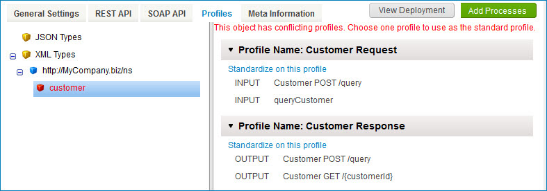

# Resolving profile type conflicts in an API Service component

<head>
  <meta name="guidename" content="API Management"/>
  <meta name="context" content="GUID-e2385eb2-c0a8-42b0-a03e-a2d14e543154"/>
</head>

Resolve profile type conflicts on the **Profiles** tab of an API Service component.

## About this task

You should not deploy API Service components that specify objects for which a profile type conflict exists. A conflict occurs when multiple referenced XML profiles include the same type and namespace or when multiple referenced JSON profiles have the same root name. You can resolve a conflict by standardizing on one profile:

## Procedure

1.  In the API Service component, select the **Profiles** tab.

    In the objects list, a profile type conflict exists for each object highlighted in red.

    

2.  Select an object for which a conflict exists.

    For the selected object, the profiles referenced in endpoint definitions are listed.

    -   For usage shown in gray, the profile is the default derived from the linked process.

    -   For usage shown in black, the profile is configured as an override.

3.  Choose the profile on which to standardize and click its **Standardize on this profile** link.

4.  In the confirmation dialog, click **OK**.

    Endpoint definitions are updated to reference that profile, thereby resolving the conflict

5.  Repeat steps 2–4 for each additional object for which a conflict exists.

6.  Click **Save** or **Save and Close**. 