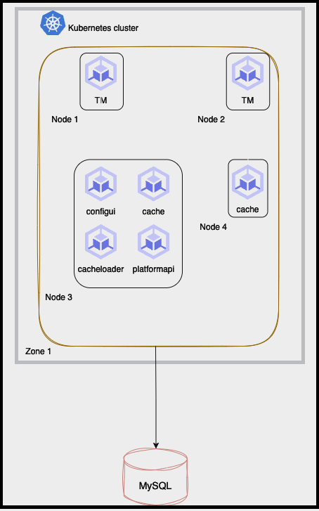
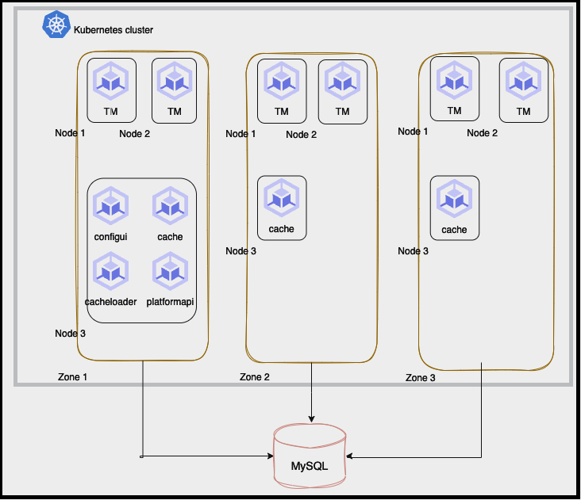

# Cluster Topologies

<head>
  <meta name="guidename" content="Cloud API Management Local 6.0.0"/>
  <meta name="context" content="GUID-f14bb530-7edd-4249-82ca-154dd7d7af14"/>
</head>

The following section shows how you can setup a cluster.

## Single Zone

## Multi Zone

## Small Topology

- Number of nodes:

  - Minimum: 2
  
  - Recommended: 4
        
- Zones: Single us-east4-a

- ConfigUI: 1

- PlatformAPI: 1

- Cache:

  - Minimum: 2
  
  - Recommended: 3
        
- TrafficManager:

  - Minimum: 2
  
  - Recommended: 3
        
- CacheLoader: 1
    
- Target QPS: 500
    

## Medium Topology

- Number of nodes:

  - Minimum: 3
  
  - Recommended: 9
        
- Zones: Multizone

  - us-east4-a
  
  - us-east4-b
  
  - us-east4-c
        
- ConfigUI: 1
    
- PlatformAPI: 1
    
- Cache: 3
    
- TrafficManager:

  - Minimum: 3
  
  - Recommended: 6
        
- CacheLoader: 1

-  Target QPS: 500, 1500, and 3000.
    

## Java Virtual Machine sizing

- TM JVM starting (-Xms) /maximum (-Xmx) heap size parameters were set to 4GB.

- cache, cache starting/maximum heap size were set to 1GB.

- PlatformAPI maximum heap size was set to 2GB
    

## Small Cluster

- 2 cache and 2 Traffic Manager pods are sharing nodes located in the same zone. Each node runs one Traffic Manager pod and one cache pod.

- PlatformAPI, Config-UI, and Cache loader pods are also on the same nodes as they have no direct role during Traffic calls.
    
- Traffic volume: 500 QPS.
    
- Application logs and access logs of all pods are forwarded to a dedicated OpenSearch cluster.
    
* No resource limits are added against any pod
    

## Medium Cluster

- 3-node cluster, one node per zone.

- 3 cache and 3 traffic manager pods. Each node (and therefore zone) hosts one cache and one TM pod.

- PlatformAPI, ConfigUI and cache loader pods run the same nodes as they have no direct role during traffic calls and use few resources.

- Traffic volume: 500/1500/3000 QPS.

- Application logs and access logs of all pods are forwarded to a dedicated OpenSearch cluster.

- No resource limits are set for any pod.

- TM JVM starting/maximum heap size - 4GB
    

## Generated traffic model

- 25% protected and 75% unprotected traffic

- Request Size is constant: 2kb

- Response size distribution of traffic:
    
    72% traffic → Size 0-4kb (Random distribution of response sizes → 2b,1kb, 2kb, 4kb)
    
    28% traffic → Size 4kb -16kb (Random distribution of response sizes → 4kb, 8kb, 16kb)
    
- Minimum response time from Latency Injectors are configured to be 1 millisecond.
    
- No Token generation calls are included.
    
- 20 Endpoints with quota set at unlimited (i.e. no counters) used for unprotected traffic and 20 endpoints used for protected traffic with high (50,000,000) daily quota and throttle (20,000,000) values.