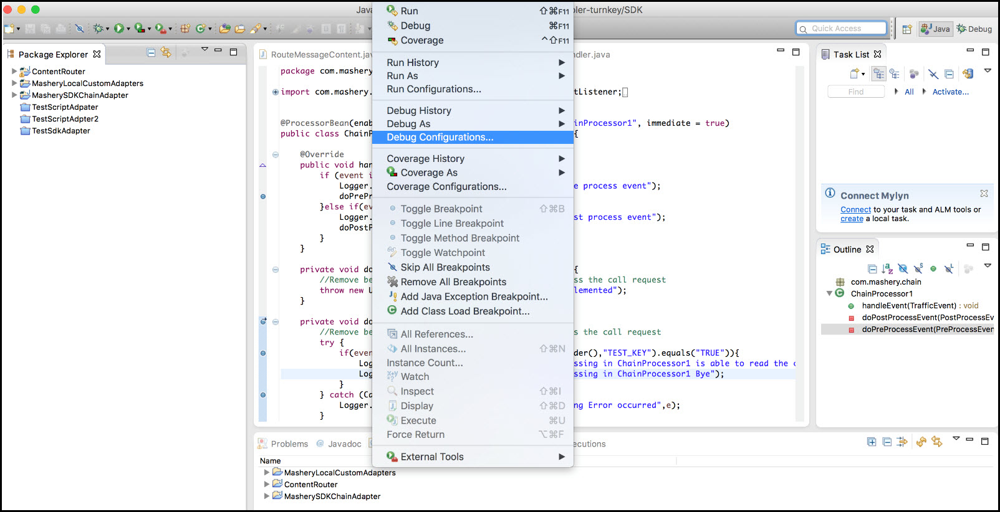
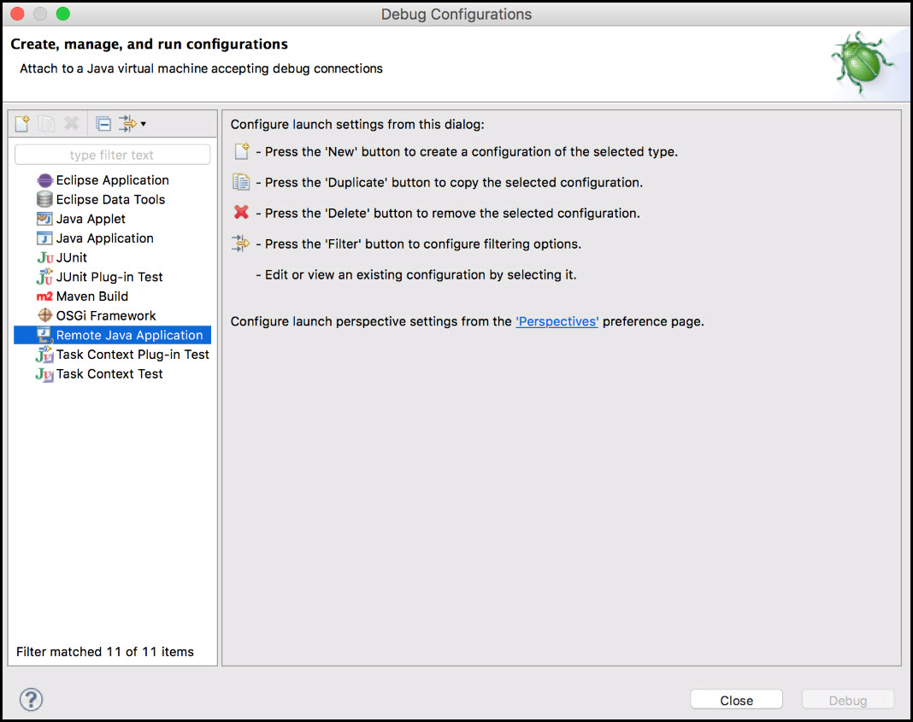
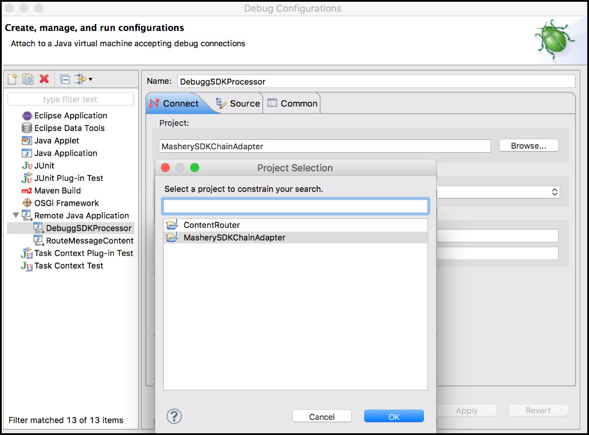
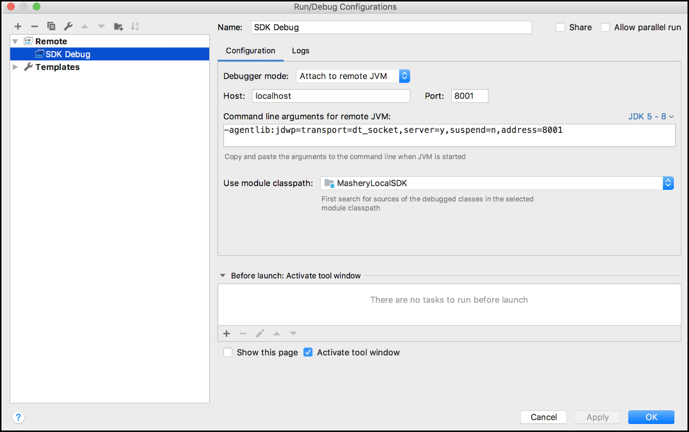
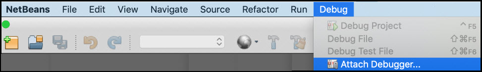
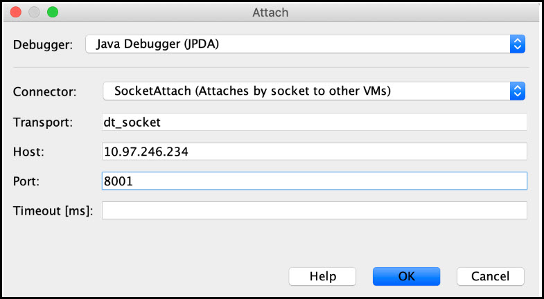

# Debugging SDK Processor Remotely

<head>
  <meta name="guidename" content="API Management"/>
  <meta name="context" content="GUID-cc854cc8-26c5-4234-b7bd-155338bd5875"/>
</head>

## Preparing Traffic manager container

1. Set up the cluster and connect to the tml-tm container. 

   `docker ps | grep -i tml-tm`

   `docker exec -it {tml-tm-container_id} bash`

2. Enable **Javaproxy with debugger** agent by running the following command: 

   ```
   Edit the file /opt/javaproxy/proxy/proxy.ini and add below line at the end
   -agentlib:jdwp=transport=dt\_socket,address=8001,server=y,suspend=n
   ```

   Save the changes. 

3. Restart the proxy as shown below. 

   ```/etc/init.d/javaproxy restart```

## Preparing the IDE

### Eclipse

1. Open the IDE and configure the debugger to connect to a remote port. 

2. Click **Debug Configurations**. 

   

3. The **Debug Configurations** window opens, here click **Remote Java Application**. 

   

4. Click the New button  , to create a new configuration. The right side of the screen displays options to create a new configuration. 

5. In the **Connect** tab, select the **Project** by clicking **Browse**. In the **Project selection** window, select the SDK Processor's project. 

   

6. In the **Connection Properties** field, for the Host field, input the node's IP and for **Port**, input 8001. Click **Apply** and then click **Debug**. 

### IntelliJ Idea

1. From the main menu, click the **Run** option and select **Edit Configuration**. 

2. Click the button and select **Remote** from the configuration list. 

3. In the tree structure, click **SDK Debug**. In the Debugger mode field, select **Attach to remote JVM**. For the Host field, input the node's IP and for **Port**, input 8001. 

   

On successful completion, you can see the toolbar in the IntelliJ Idea window. Click the green debug icon, when you wish to debug.


### Apache NetBeans

1. In the **NetBeans** window, click the **Debug** menu, and then click **Attach Debugger**. 

   

2. The **Attach** dialog opens, here provide the input for **Debugger**, **connector** and **Transport**. 

   

3. For the **Host** field, input the node's IP and for **Port**, input 8001. Click **OK**. 

The debug view opens. Set the required breakpoints in the processor code and call an end point. 

## Fix, Build, and Deploy

### Fix 

Fix the issues found on debugging by fixing the code. 

### Build

1. Run the built script. 

   ```/home/user/MasheryLocalSDK$ ./build-adapter.sh```

   The build script reports the compilation errors. In case of any reported errors, rerun the build script. 

2. The script generates an archive file as `tml-mashery-customer-extension.zip` under *MasheryLocalSDK*. Upload this file to the installer. 

### Deploy

1. Find the container ID of the `tml-tm` container using the following command: 

   ```docker ps | grep -i "tml-installer"```

2. Copy the `upload-deploy-sdk-processor.sh` script from the installer to the local path. 

   ```docker{tml-installer-contianer-id}:/var/jenkins\_home/docker-deploy/docker-swarm/system/upload-deploy-sdk-processor.sh {path\_to\_save}```

3. Use the `upload-deploy-sdk-processor.sh` script to upload and deploy the already built SDK processors in the `tml-tm` container. 

   ```
   ./upload-deploy-sdk-processor.sh --help
   Usage: ./upload_deploy_sdk_processor.sh [--adapter-zip <ADAPTER_FULL_PATH>] [--tml-tm-container <TM_CONTAINER>]
   ( --adapter-zip | -a ) -  path/filename of the adapter zip to be uploaded to container
   ( --tml-tm-container| -c ) - TML-TM Container ID where adapter to be uploaded

   Example: ./upload-deploy-sdk-processor.sh --adapter-zip

   /home/user/MasheryLocalSDK/dist/tml-mashery-customer-extension.zip --tml-tm-container 9c9e09ea1f95
   ```

4. Log in the tml-tm container, 

   ```docker exec -it {tml-tm-container-id} bash```

   and restart thejavaproxy service using the following command: 

   ```/etc/init.d/javaproxy restart```
