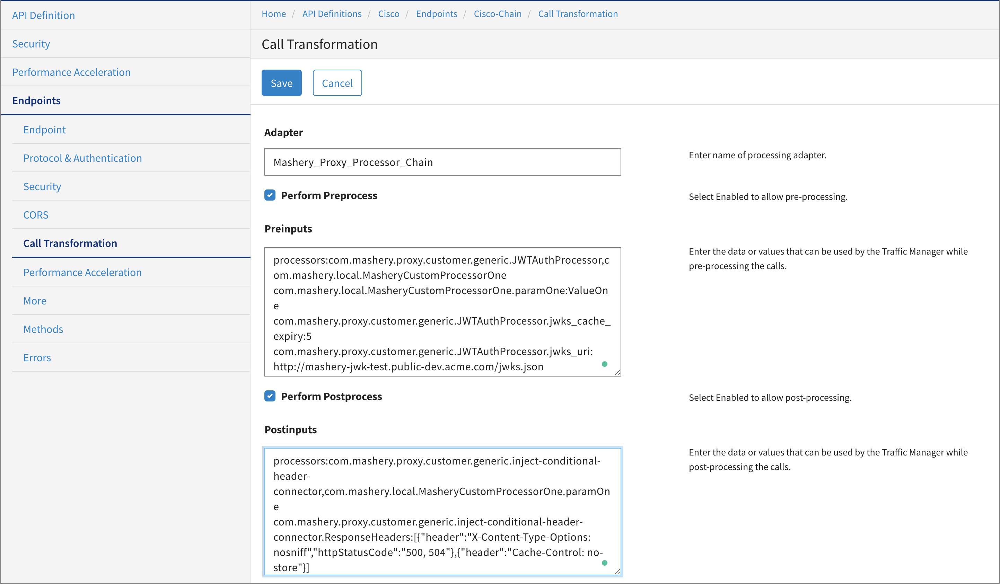
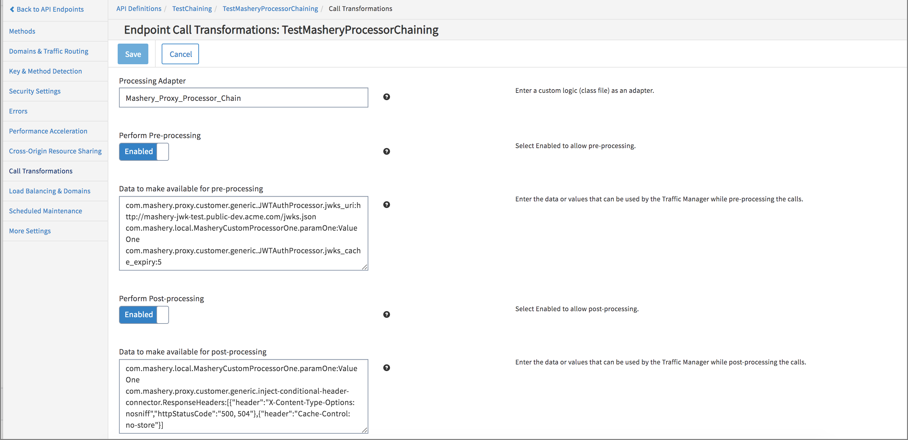

---
sidebar_position: 2
---
# Chaining of Processors Using Mashery\_Proxy\_Processor\_Chain

<head>
  <meta name="guidename" content="API Management"/>
  <meta name="context" content="GUID-d571e687-549e-4a8c-9c07-6b42d8d09484"/>
</head>

Using `Mashery_Proxy_Processor_Chain` processors can be chained in an untethered environment and in a tethered environment. 

## Chaining Processors in an Untethered Environment

1. In the **Configuration Manager**, click the **Endpoints** tab and then click **Call Transformation**. 

   

2. Input the **Adapter** name with the built-in adapter as `Mashery_Proxy_Processor_Chain`.

3. As per requirement, select the checkbox for **Perform Preprocess/Perform Postprocess or both**.

4. In the **Preinputs** field, type the processors to be chained. The name of the processor is the processors bean name. The syntax is: 

   ```processors:PROCESSOR1,PROCESSOR2```

   For example:

   ```processors:com.mashery.local.MasheryCustomProcessorOne,com.mashery.local.MasheryCustomProcessorTwo```

   You can also provide configuration data as input. The syntax is:

   ```
   PROCESSOR1.parameter:value
   PROCESSOR1.parameter:value
   PROCESSOR2.parameter:value
   PROCESSOR2.parameter:value
   ```

:::note

- In the pre-input configuration, there must not be more than one key with the name "processors". 

- The processors to be chained must be input as a comma-separated list.

5. In the Postinputs field, input the name of the adapter that the traffic manager can use to post-process the calls, then click Save. 

   - The input syntax for the Postinputs fields must be the same as that of the Preinputs field.

   - If you opt for only Perform Postprocess, the input for Postinputs field must be as follows:

      ```processors:com.mashery.local.MasheryCustomProcessorOne,com.mashery.local.MasheryCustomProcessorTwo```

      and

      ```
      PROCESSOR1.parameter:value
      PROCESSOR1.parameter:value
      PROCESSOR2.parameter:value
      PROCESSOR2.parameter:value
      ```

## Chaining Processors in a Tethered Environment

The process for chaining processors in a tethered environment is the same as that of untethered. The interface of the control center appears as shown below:



## What to do next

To test the changes, use the endpoint and make a traffic call.


