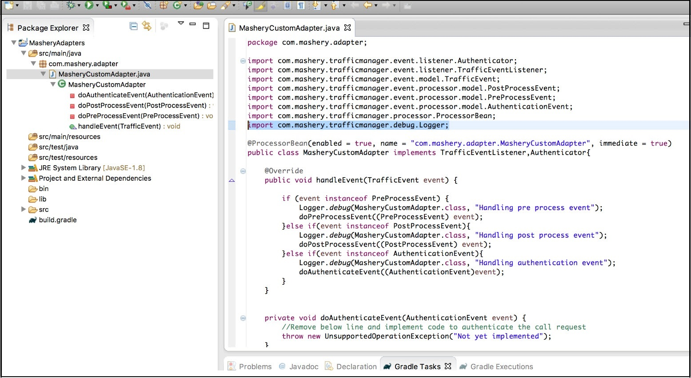

---
sidebar_position: 2
---
# Creating an Adapter using Eclipse

<head>
  <meta name="guidename" content="API Management"/>
  <meta name="context" content="GUID-405055df-3d9c-4d00-9fad-518ff52cbaed"/>
</head>

Preparing Eclipse: 

1. On the Eclipse user interface, point to the Help tab and click **Eclipse Marketplace**. 

2. Search Gradle and install. 

## Importing the SDK into Eclipse IDE

1. On the **File** tab, click **Import**. 

2. In the **Import** dialog, select the Gradle project. 

3. The **Import Gradle Project** wizard opens, follow through till the end. Close the wizard by clicking **Finish**. 

4. The explorer shows the uploaded project with its contents. 

