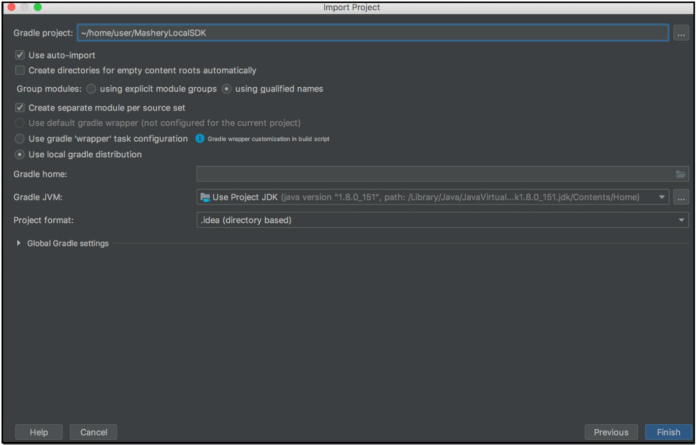
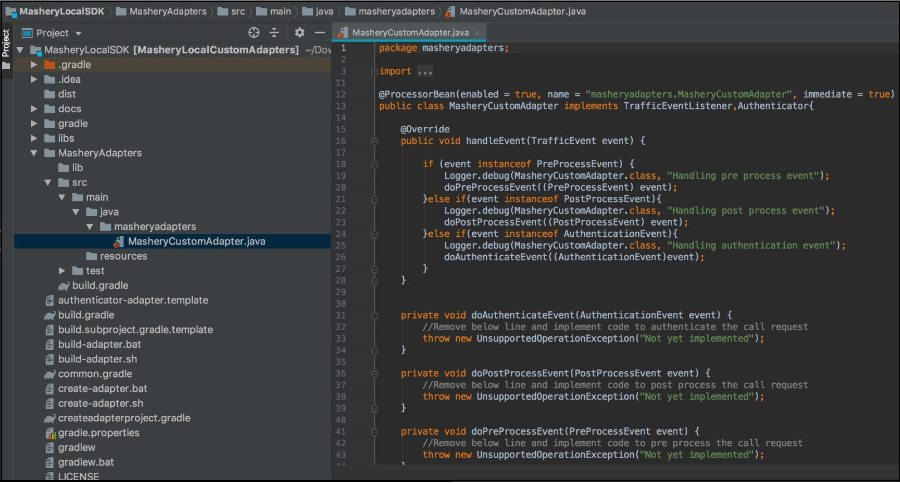

---
sidebar_position: 3
---
# Creating an Adapter using IntelliJ IDEA

<head>
  <meta name="guidename" content="API Management"/>
  <meta name="context" content="GUID-aaf63dac-06a9-4b2b-a77f-37a8b23cff98"/>
</head>

Preparing IntelliJ IDEA: 

1. Open IntelliJ IDEA and click **Import Project**.

2. In the **Import Project** dialog, navigate to the SDK folder as input for **Gradle project**. 

   

   Select the Gradle options as shown in the image. 

3. Click **Finish** to upload the project. The content of the project can be seen in the project view. 

   

   Copy the required third-party libraries in the lib folder of the sub project. 

