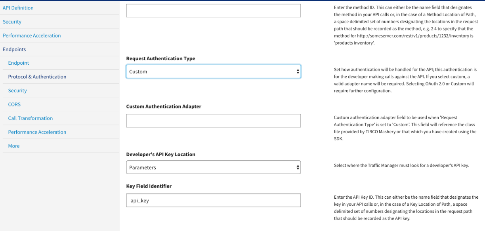
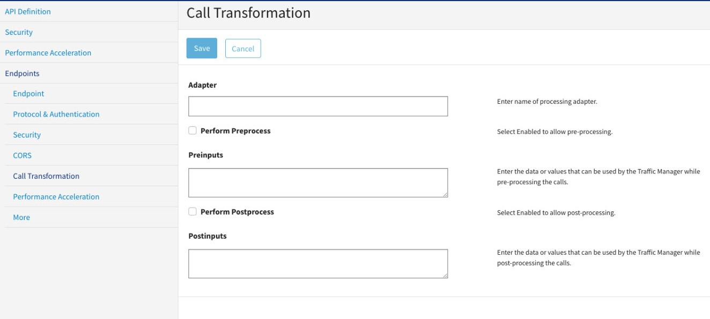

---
sidebar_position: 6
---

# Configuring Endpoints for Processors

<head>
  <meta name="guidename" content="API Management"/>
  <meta name="context" content="GUID-db4a69f5-53af-499d-bfd3-057d0cdf9e35"/>
</head>

1. Navigate to the Config Manager GUI from your setup. 
1. Navigate to the API's endpoint. 

## Procedure

To register a custom authenticator: 

1. In the Configuration Manager, click the **Endpoints** tab and then click **Protocol & Authentication**. 

2. Select **Request Authentication Type** as **Custom**.

3. In the **Custom Authentication Adapter** field, provide the processor bean's name from adapter `com.companyname.mashery.adapter.MyCustomAuthenticator`. 

To register a processor: 

1. In the **Configuration Manager**, select the **Endpoints** tab and then click **Call Transformation**. 

2. In the **Adapter** field, provide the processor bean's name from adapter `com.companyname.apim.adapter`. 

3. Select the appropriate checkbox for performing the transformation preprocess or postprocess. 

