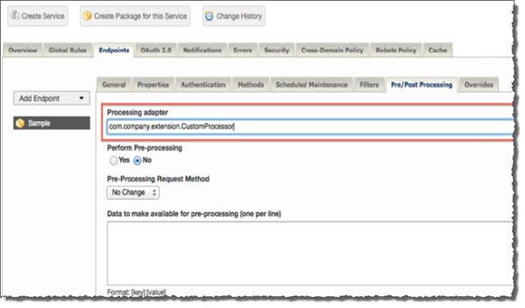

---
sidebar_position: 7
---

# Implementing the Event Listener

<head>
  <meta name="guidename" content="API Management"/>
  <meta name="context" content="GUID-04adf6c9-02ec-48f3-a900-72f25ac24779"/>
</head>

## Procedure

1. Employ the Traffic Event Listener interface (introduced in [Event Listener API](../SDK%20Guide/Pre_and_post_processor_extension_points.md)) as shown in the following example: 

```xml
package com.company.extension;
public class CustomProcessor implements TrafficEventListener{
public void handleEvent(TrafficEvent event){
//write your custom code here
}
}
```

2. Annotate your code to ensure that the processor is identified correctly for callbacks on events related to the specific endpoints it is written to handle: 

```xml
@ProcessorBean(enabled=true, name=”com.company.extension.CustomProcessor”,
immediate=true)
public class CustomProcessor implements TrafficEventListener{
public void handleEvent(TrafficEvent event){
//write your custom code here
}
}
```

   The annotation identifies the following properties: 

   1. **enabled**: Identifies if the processor is to be enabled. 

   2. **name**: Identifies the unique name of the processor as configured in API Settings (see marked area in ‘red’ in the following screenshot). 

   3. **immediate**: Identifies if the processor is enabled immediately. 

:::note

The name used in the annotation for the Processor MUST be the same as configured on the portal for the Endpoint>Pre/Post Processing, as shown in the following screenshot: 



:::

