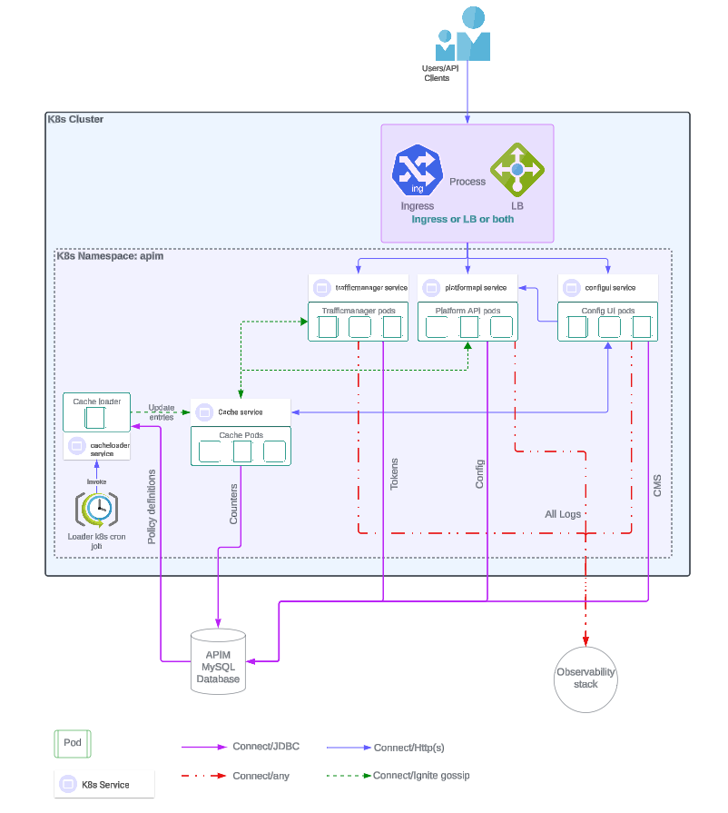
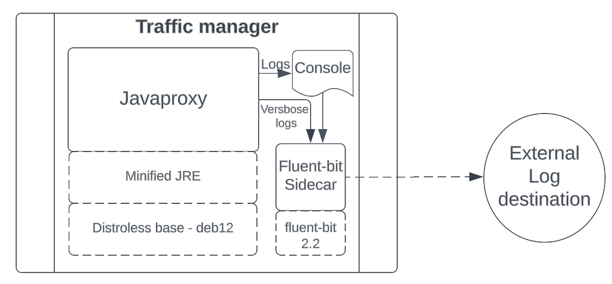
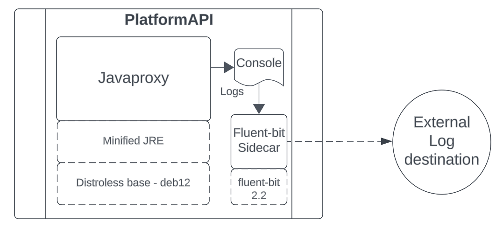
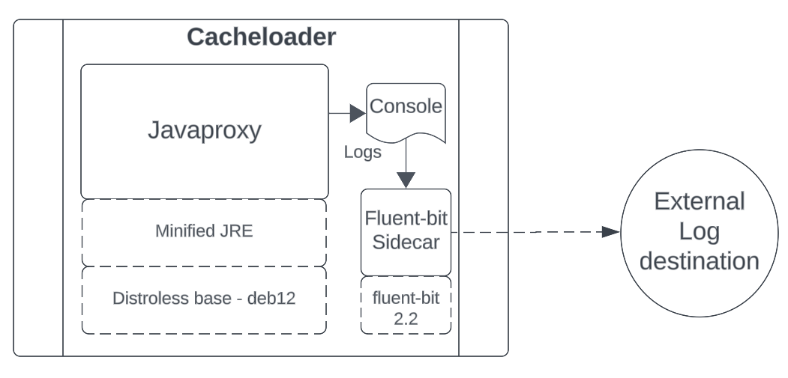
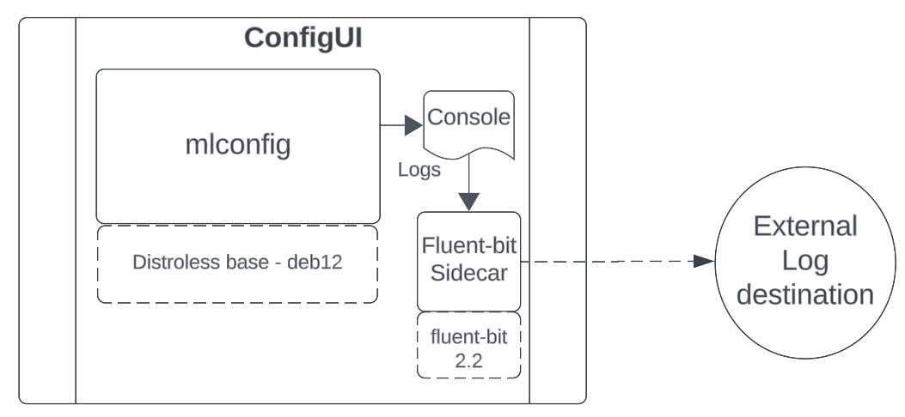
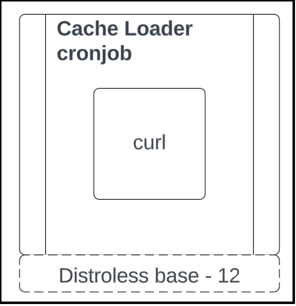

# API Management - Local Edition Overview

This section provides an application description with the breakdown of different components.

Local Edition is an architectural re-write adhering to Kubernetes (K8s) best practices and compliance to 12 factor design principles. It consists of the following components.

1.  Traffic manager
    
2.  Cacheloader
    
3.  Platform API
    
4.  Config UI
    
5.  Fluent Bit logging Sidecar attached to each workload or container
    
6.  Cron jobs
    
7.  Cache
    

All components are deployed as stateless and volume-less. You can define Horizontal Pod Autoscaler (HPA) rules for each of the components.

For more information about HPA, see [Kubernetes documentation](https://kubernetes.io/docs/tasks/run-application/horizontal-pod-autoscale-walkthrough/).

## Types of application pods

All pods are run as deployment or replica sets, and workloads can be moved across nodes and zones. Containers are based on Google distroless non-root images. In containers based on non-root images, the default user is a non-root with id 65532.

### Deployment or Replica Sets

Deployment architecture is as follows:

#### Traffic Manager

The traffic manager consists of two containers (workloads) - The Java proxy and the Fluent Bit Sidecar. The traffic manager handles all API traffic and OAuth traffic.

All application logs are routed to a Fluent Bit Sidecar. For more information, see [Fluent Bit documentation](https://docs.fluentbit.io/manual/installation/kubernetes).

All traffic data such as Access logs, Verbose logs, and Payload logs are routed to the Fluent Bit Sidecar. The Fluent Bit Sidecar by default logs to the console. You must configure a Fluent Bit Sidecar to send logs to the external destinations such as Elastic Stack, OpenSearch.

#### Platform API

The Platform API provides a secure way to invoke data APIs (that is used by the Config UI) to create database objects. All application logs are routed to the Fluent Bit Sidecar.

#### Cacheloader

The Cacheloader keeps the cache updated at scheduled intervals. The Cacheloader can update the cache for delta changes or do a full reload.

#### Config UI

The Config UI provides a user interface to interact with objects such as Services, Packages, Plans, Package Keys.

### Jobs

#### Cacheloader Invoker job

The Cacheloader invoker job has the following types of jobs:

*   On Startup job - It invokes the Cacheloader with full load options
    
*   K8s cron job - It handles delta and full load as per the schedule and periodicity.
    

You can adjust the cron schedule from `values.yaml`.

For more information, see "values.yaml" in Boomi Cloud API Management - Local Edition Installation.

## Required Resources

Before installing Local Edition, see "Prerequisites" and "Preinstallation Checklist" sections in Boomi Cloud API Management - Local Edition Installation.