---
sidebar_position: 1
---

# Configuring API Definitions and Endpoints

<head>
  <meta name="guidename" content="API Management"/>
  <meta name="context" content="GUID-8e80f9e6-0e54-488f-b564-f8233b101570"/>
</head>

The **API Definitions** page displays a navigable list of API definitions. To add a new API definition, click **New**. 

The following table describes the fields on the **API Definitions** page. 

|**Field** |**Description** |
| -------- | -------------- |
|Name|Name of the API. |
|Version|Version of the API. |
|API Service Key|Service key of the API|
|Organization|Organization of the API|
|Description|Description of the API. |
|Created|The date and time when the API definition was created. |
|Updated|The date and time when the API definition was updated. |
|Actions| |
||Navigates to the **API Definition Settings** page, where properties of the API can be edited. |
||Deletes the API definition. |

The **API Definitions** page has the following sub-pages with further fields and settings that can be configured. 

## API Definition Settings

General settings such as API description, API version, cross-domain, and robot policies can be defined on the **API Definition Settings** page. 

The **Robots Policy** tab allows you to specify the instructions that are entered in a `Robots.txt` file. When a request comes in for a `Robots.txt` file, the instructions mentioned in the Robot Policy field are sent. 

The following example directs a Google bot not to view `index.html` file and the images directory. This way you can restrict robots from accessing multiple areas.

User-agent: Google bot

Disallow: /index.html

Disallow: /images/

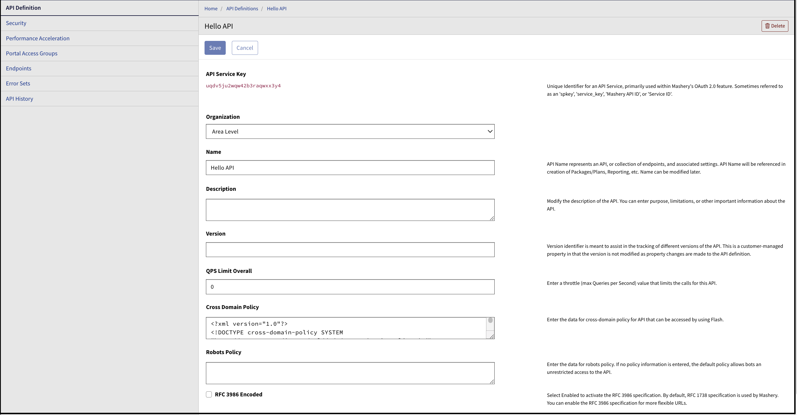

After entering the policy and other details, click **Save** to save the changes. 

## Security

The **Security** page allows you to enable OAuth 2.0 for an API. The OAuth settings are applied to all endpoints that are configured to use OAuth as the security mechanism. Some of these settings can be overridden at the endpoint level. 

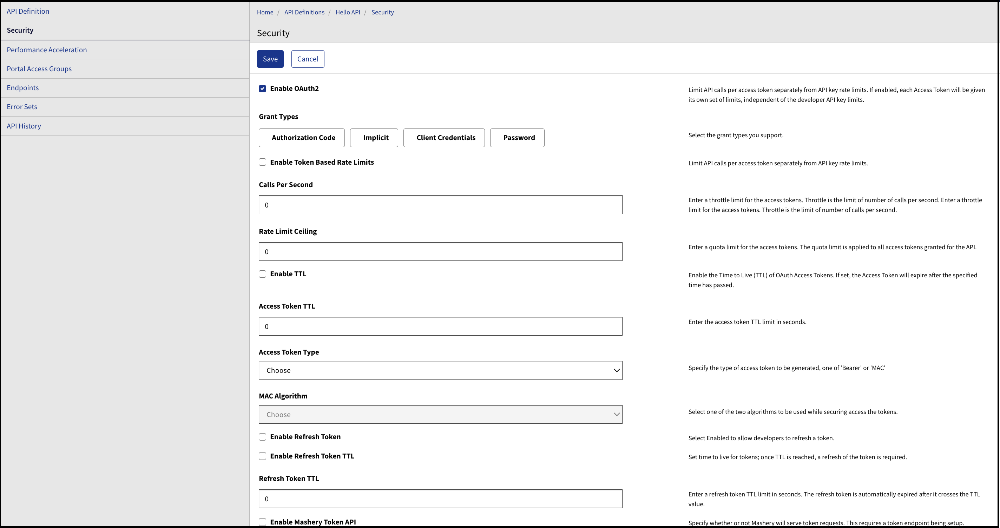

:::note

This section is applicable only for those customers who are using the OAuth 2.0 Accelerator feature as part of their contract. Contact Boomi Support if you have questions about the OAuth 2.0 Accelerator. 
:::

## Performance Acceleration

An API's performance can be improved by caching the responses in the cache. 

The following table describes the field on the **Performance Acceleration** page. 

|**Field** |**Description** |
| -- | -- |
|Cache Time-To-Live (TTL) |The length of time the data is stored in a cache. You can use the dropdown to select a TTL value. By default, the TTL is defined in increments of 0.1 minutes. |

## Portal Access Groups

In the 88Portal Access Groups88 page, specify the roles that are applicable to the API definition in the Developer Portal. The portal displays only the interactive documentation that is appropriate for your given role. 

## Endpoints

After an API is created, you can create, modify, and delete endpoints associated with the API on the **Endpoints** page. 

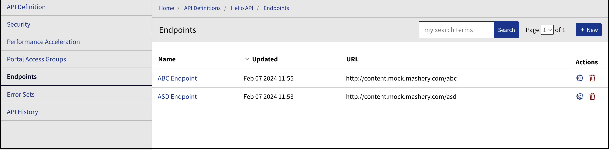

While you are viewing or creating endpoints, you can access the API Definition-related endpoint settings by using the navigational tabs on the left pane of the page. The following sub-pages are available from the **Endpoints** page. 

**Endpoints Page**

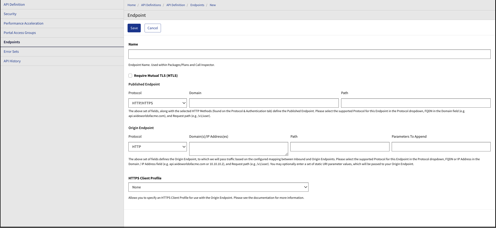

The **Endpoint** sub-page allows you to create the name of the endpoint, as well as configure Mutual TLS (MTLS), HTTP Client Profile, Public Endpoint Address, and Boomi Cloud API Management Endpoint Address. 

**Configuring an Endpoint to Use MTLS**

To configure an endpoint to use MTLS, select the **Require Mutual TLS MTLS** checkbox. 

**Protocol & Authentication Page**

The **Protocol & Authentication** page allows you to set the key and method details related to an endpoint. You can select parameters such as the endpoint type, supported HTTP methods, method location, and Developer API key location. 

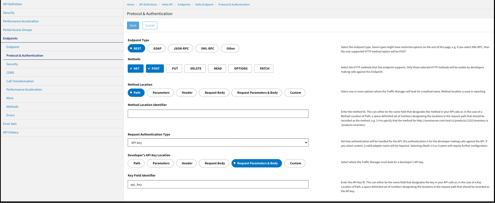

**Security Page**

The **Security** page allows you to enable System Domain Authentication. 

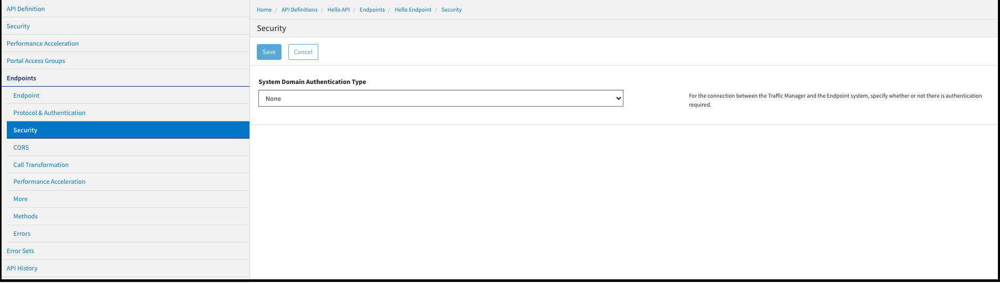

**CORS Page**

The **CORS** page allows you to configure Endpoint Cross-Origin Resource Sharing, a W3C standard that defines how the browser and server should interact when cross-domain requests are made. 

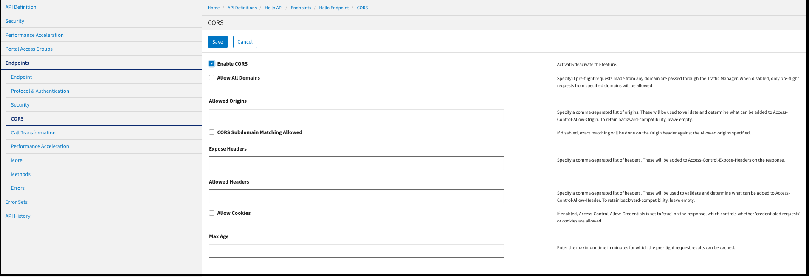

**Call Transformation Page**

The **Call Transformation** page allows you to apply processing logic to an API call before it is sent to the host API servers and after the call is returned from the client API servers. 

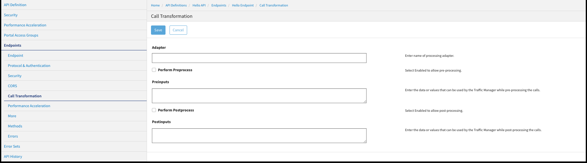

**Performance Acceleration**

Endpoint performance can be optimized by managing the cache. If your call responses are cacheable, specifying appropriate caching rules reduces the end-to-end latency time of API calls. The caching rules set at an endpoint-level, as shown in the following image, affect all calls made to the endpoint. 

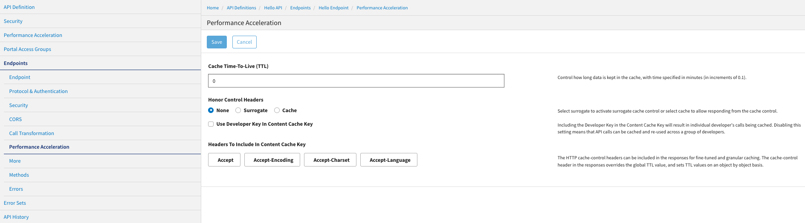

**More Page**

The **More page** allows for configuring Traffic-Manager-specific settings. You can configure the Traffic Manager to include or exclude headers from the requests and responses. 

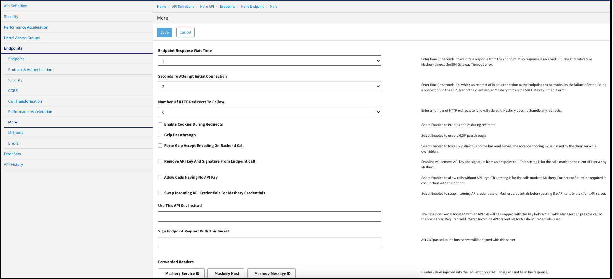

**Methods Page**

An endpoint is a piece of logic that contains various methods. You can define multiple methods by entering valid schema files.

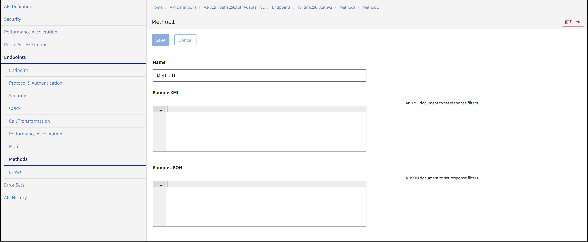

**Errors Page**

The **Errors** page allows you to configure endpoint error responses for this API definition.

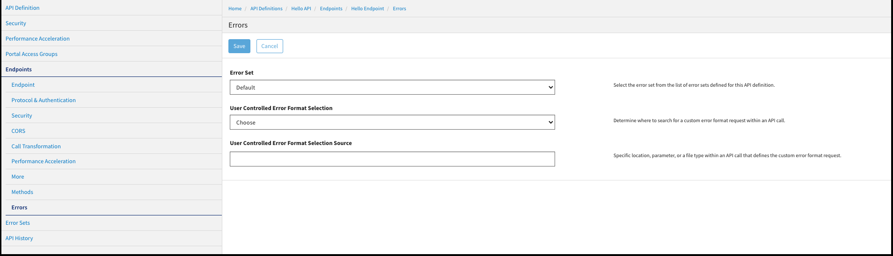

## Error Sets

The **Error Sets** page allows you to create and configure multiple error sets for error conditions.

To create an error set, click **New**.

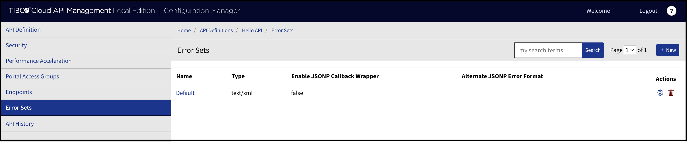

## Error Messages

This page displays the error codes and the error status for the developers to identify why an error is displayed. You can edit error code status messages.

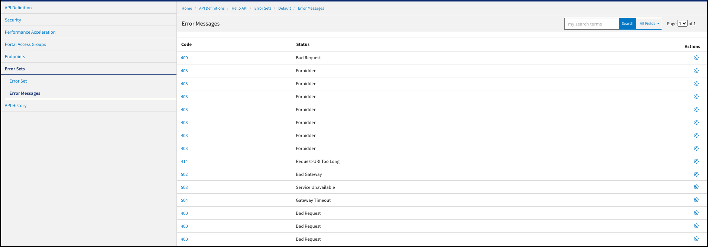

## API History

The **API History** page displays the history of changes made for the selected API definition. In addition to viewing historical information, users have the ability to compare versions, and revert to an earlier version of an API definition.

To compare API versions, select the versions using the checkboxes, then click **Compare Selected**. A pop-up window displays and lists any changes between the selected versions.

To revert to an earlier version of an API, click the **Revert** icon in the **Actions** column for the desired API version.

