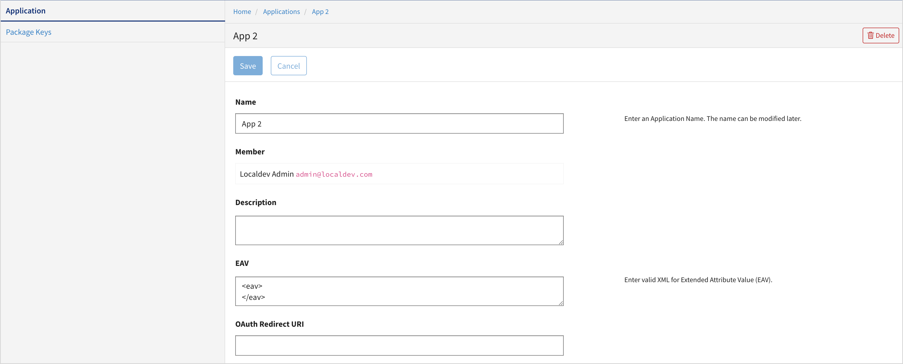
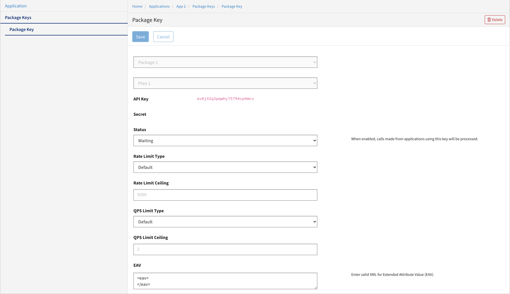

---
sidebar_position: 1
---

# Configuring Applications and Package Keys

<head>
  <meta name="guidename" content="API Management"/>
  <meta name="context" content="GUID-aac19fe4-7417-4a9f-af85-a6d0f41d54c3"/>
</head>

The **Applications** page allows you to configure applications and manage the package keys associated with applications. 

The following table describes the fields displayed on the **Applications** page. 

|**Column Name** |**Description** |
| --- | --- |
|Name|The name of the application. |
|Description|The description of the application. |
|Created|The date and time when the application was created. |
|Updated|The date and time when the application was last updated. |
|**Actions**| |
||Click to modify the application. The **Applications Settings** page is displayed. You can modify the fields as required. |
||Click to delete the application. |

The following sub-pages are available from the **Applications** page. 

## Applications Settings Page

The **Applications Settings** page allows you to configure settings, such as name and description, for a specific application. 

## Package Keys Page

The **Package Keys** page allows you to configure the package keys associated with an application. 

The throttle and the quota limits can be specified at the key level. These limits override the limits set at the Plan level. 

To set key overrides: 

1. On the **Package Keys** page, click the specific key, (or click the edit icon for the specific key). The **Package Key** page is displayed. 

   

2. Set the rate limits and QPS limits for this key list. Click **Save**. 

