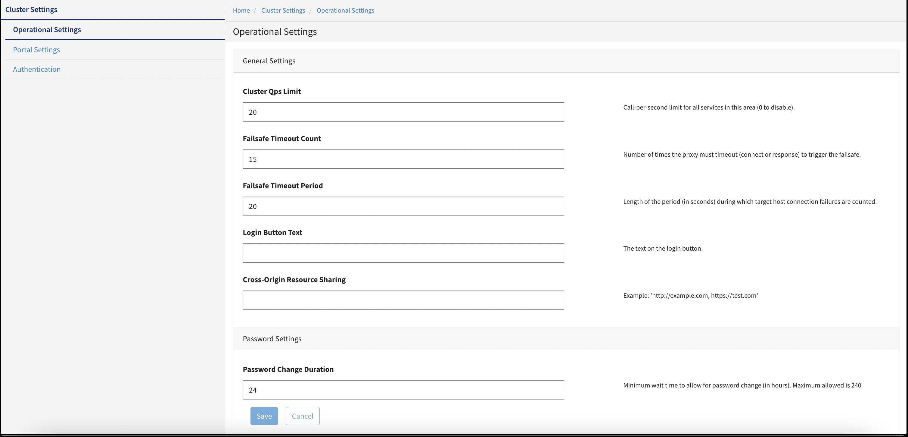

---
sidebar_position: 1
---

# Configuring Cluster Settings

<head>
  <meta name="guidename" content="API Management"/>
  <meta name="context" content="GUID-0a62d3f1-f643-4a6d-869b-e2540e73c133"/>
</head>

The **Cluster Settings** page displays editable administrator information, and provides
master operational settings for the Local Edition configuration, with fields and values that
impact the entire area

