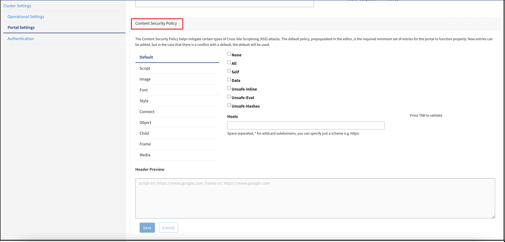
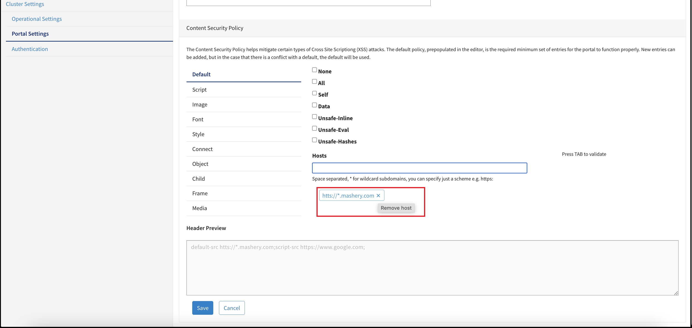
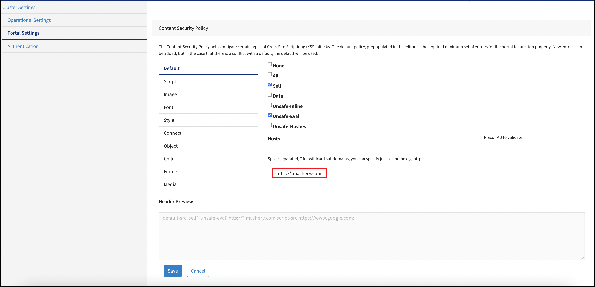
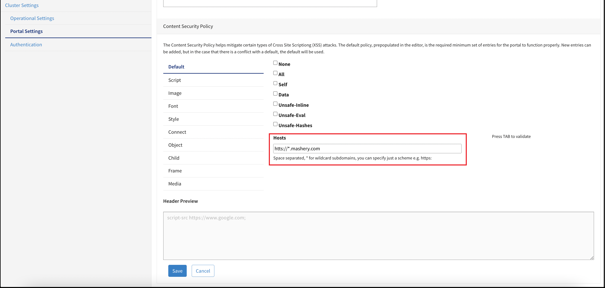
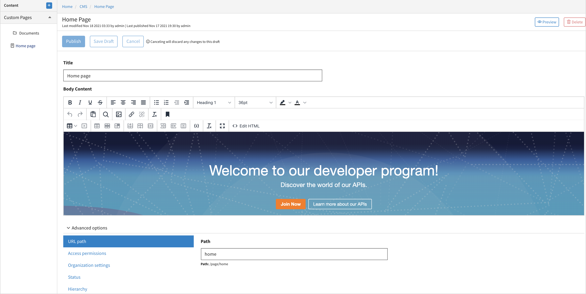
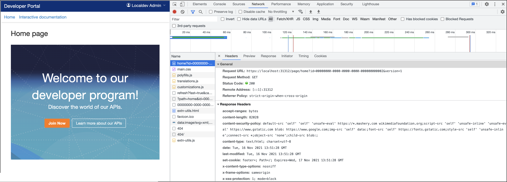

---
sidebar_position: 2
---

# Content Security Policy Editor

<head>
  <meta name="guidename" content="API Management"/>
  <meta name="context" content="GUID-b0644672-aaec-42f7-b6d3-98aa31e0fa2a"/>
</head>

Content Security Policy (CSP) is an added layer of security that helps to detect and mitigate certain kinds of code injection attacks, such as Cross Site Scripting (XSS).

The **Content Security Policy** editor allows you to provide a secure Developer Portal experience for your customers - with tight control over the content the portal attempts to consume/integrate. The new gold standard in these regards is "maintaining a robust Content-Security-Policy on your web/application server". Carefully crafting the contract
for site content sources serves as a bulwark against XSS attacks.

As you begin implementation or customization of your Developer Portal, the out-of-thebox default policy is very restrictive. This is by design - we want your server to start out with least-privilege for the default behaviors of the core application. When you need to relax a CSP directive, navigate to the Content-Security-Policy editor:

1. Log in to **Configuration Manager** and click **Cluster Settings**.

2. Click **Portal Settings** and see the **Content Security Policy** pane.

## Default Policy

We ship a very restrictive default policy - only allowing specific assets that we need to drive our own features (example: the opt-in ReCaptcha feature, for quality-gating user registration). As a matter of fact, this 'baseline' policy is always present in the CSP, even if you choose to completely delete it from your Cluster Settings. You do not ever have to worry about your changes impacting our functionality, as the backend ensures that the necessary CSP allowances are in-place. 

## Refinement

The [Local Edition Developer Portal](../../../Developer_Portal/Developer_portal.md) is a functional, customizable blank-slate for you to foster compelling developer community engagement. As your Developer Portal evolves, you need to incorporate your brand imagery and/or other assets (potentially hosted elsewhere, from CDNs, or from inside the portal via the [ZIP File Asset Ingestion](../../../Developer_Portal/Deploy_default_portal_customizations_and_assets_to_clusters/Phase:%20Design%20and%20Development/Zip_file_contract_details.md) mechanism). You can make any changes you want to refine your portal's CSP policy in an intuitive interface. 

## Directive Support

Currently you have open-ended built-in support for the following ten directives: 

|default-src |script-src |img-src |font-src |style-src |
| :- | :- | :- | :- | :- |
|connect-src |object-src |child-src |frame-src |media-src |

For every directive above, you can: 

- Use checkboxes to designate boolean yes/no policy elements 

- Add hosts to the directive 

- Remove hosts from the directive

- Review your configured CSP 

- Live-preview the unsaved/proposed changes to your CSP 

## Adding Hosts

To add a host/domain to a directive: 

1. Type into the **Hosts** editor. 

2. Then press **TAB**. 

:::note

At this point, the **Preview** reflects your current in-page configuration, but it cannot be enforced by the Developer Portal until you click **Save**.

:::

2. Click **Save**.

## Removing Hosts

When you want to remove a host from a particular CSP directive, you can simply hover your mouse over the host that you no longer want in the policy - the tag-like bubble expands and you can click the X on the right side of the host name to remove it from the CSP.

## Preview

As you refine your CSP, you can see that the **Preview** pane gets automatically updated to show you what the new policy looks like in the browser.

## Testing

When you want to test your policy, simply navigate to any Developer Portal page and you can inspect the Content-Security-Policy header that applies to the requests to the portal domain. 

1. Click the [Content Management System ](../Configure_the_CMS/Configuring_the_content_management_system.md)Preview button on a content object. 

2. Open the Network debugging tool for your browser and select a call to your portal domain.

All the Developer Portal pages coming from your cluster have your chosen policy enforced. 

