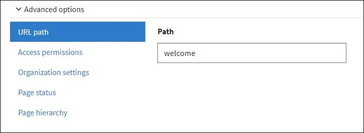
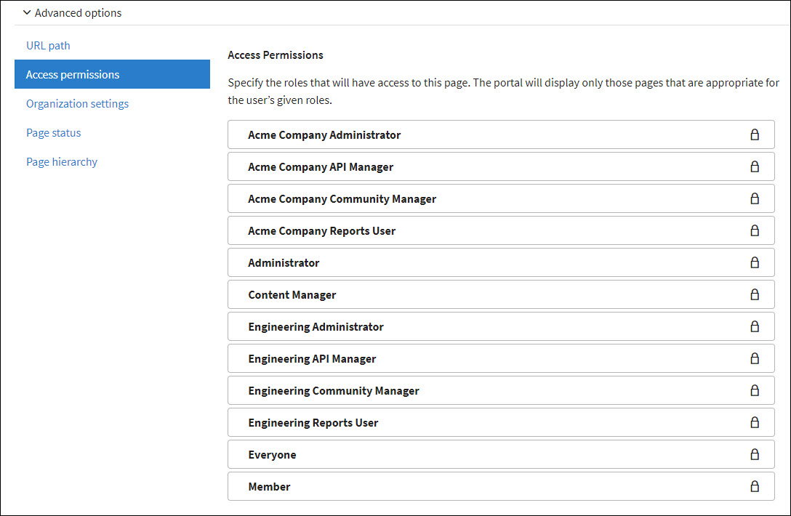
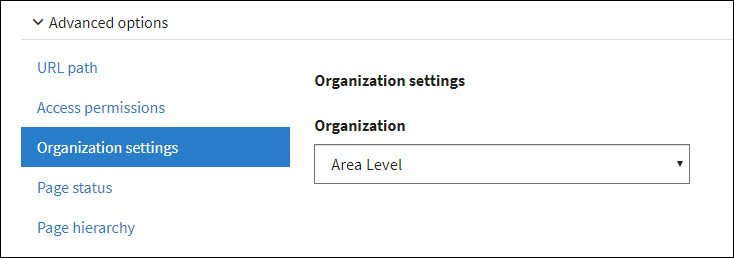
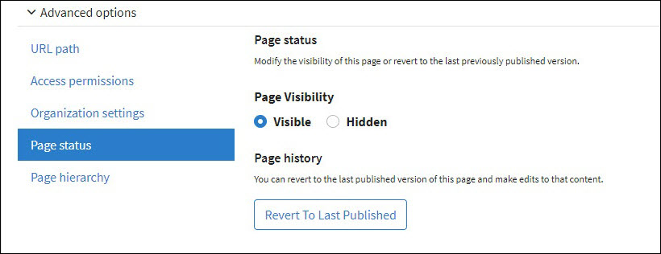
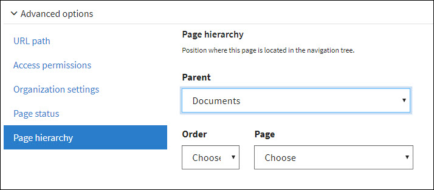

---
sidebar_position: 2
---

# Setting Advanced Options

<head>
  <meta name="guidename" content="API Management"/>
  <meta name="context" content="GUID-6a712bd6-02e1-4a98-adf2-9d3229926e9b"/>
</head>

Use the Advanced options settings to configure the following properties for an existing CMS content page. 

- URL path 

  

- Access permissions 

  

- Organization settings 

  

- Page status 

  

- Page hierarchy 

  
