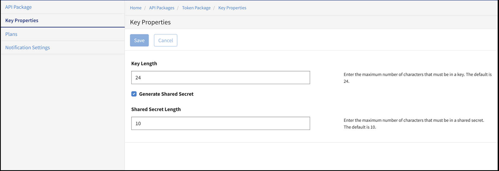
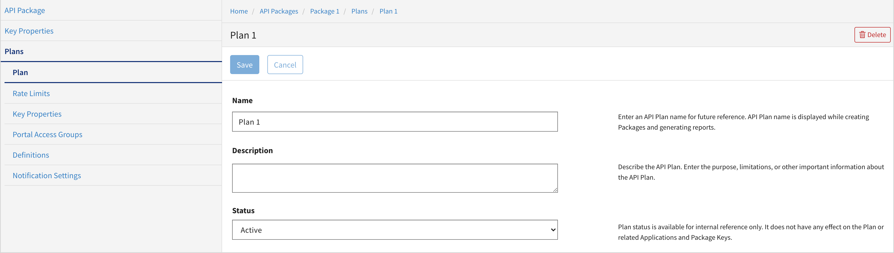
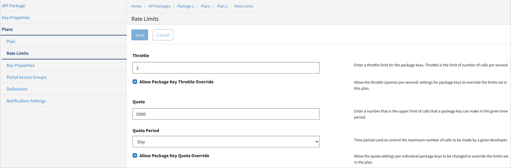
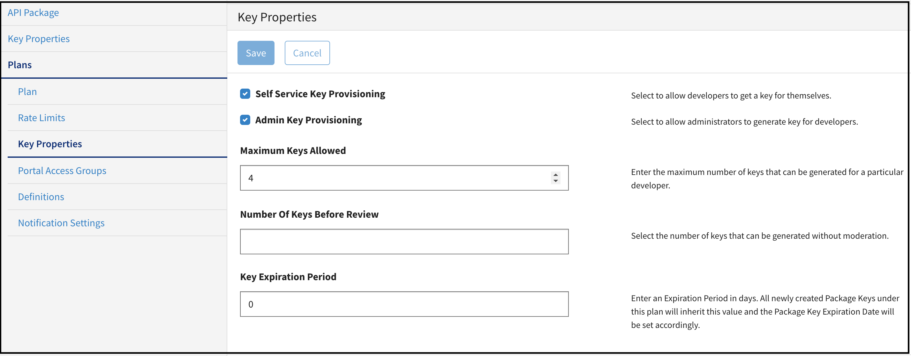
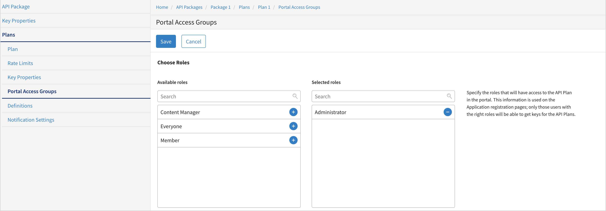
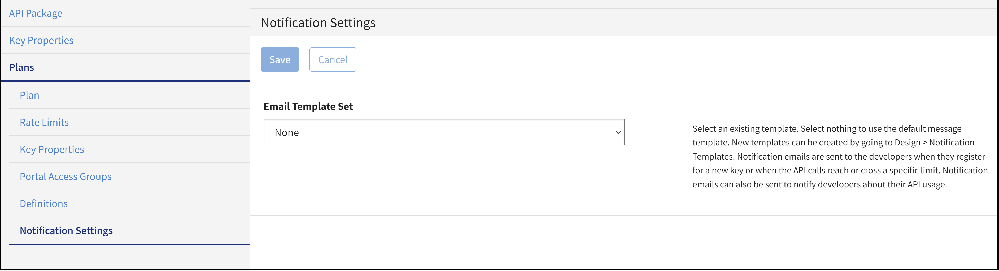
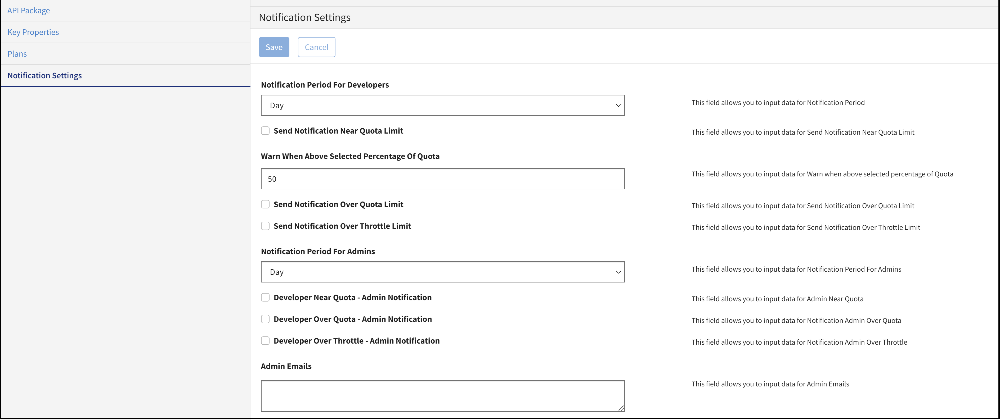

---
sidebar_position: 4
---

# Configuring API Packages and Plans

<head>
  <meta name="guidename" content="API Management"/>
  <meta name="context" content="GUID-8850aca0-4890-4be7-ad85-e550bf346105"/>
</head>

The API Packages page allows you to manage (create, view, and delete) packages and plans associated with APIs. 

The following table describes the fields on the Packages page. 

|**Field** |**Description** |
| :-: | :-: |
|Name|Name of the Package. |
|Description|Description of the Package. |
|Organizations|Organization of the package|
|Created|The date and time when the Package was created. |
|Updated|The date and time when the Package was updated. |
|Actions| |
||Navigates to the API Package Edit page, where properties of the Package can be edited. |
||Deletes the Package. |

The following sub-pages are available from the **API Packages** page. 

## API Package Edit Page

The **API Package Edit** page allows you to configure the name and description of the package. 

## Key Properties Page

## Plans Page

The **Plans** page allows you to configure the name and description of the plan. 

The following sub-pages are available from the **API Packages Plans** page.

## Plan Page

The Plan page allows you to configure the name, description, and status for a package's plan. 

## Rate Limit Page

The **Rate Limit** page allows you to configure call rate limits for a particular package's plan. 

## Key Properties

The **Key Properties** page provides settings to help you to allow or restrict the developers or administrators from generating keys for the package's plan. 

The package key is generated for the developers to access a particular package and the associated plan. A key adapter and other key properties can be set on the **Key Properties** page. 

All newly created package keys under this plan inherit the **Key Expiration Period** value and the **Package Key Expiration Date** is set accordingly. 

## Portal Access Groups

The **Portal Access Groups** page allows you to specify the roles that have access to the API plan in the portal. 

## Definitions

The Definitions page allows you to activate and link the API definition to a plan. 

## Selecting Endpoints for a Definition

Once the API definition is activated, on the Endpoints page, click the **Activate** link for the endpoint in the **Available Endpoints** list. The endpoint moves to the **Activated Endpoints** list.

## Selecting Endpoint's Methods for a Definition

Once the endpoint is activated, on **Methods** page, activate the methods.

You can select from different methods defined on the endpoint. Click **Activate** to enable the method for this plan.

## Notification Settings for Plan

## Notification Settings Page for Package

On this page, you can specify the email address to which email notifications for quota and throttle must be notified.

