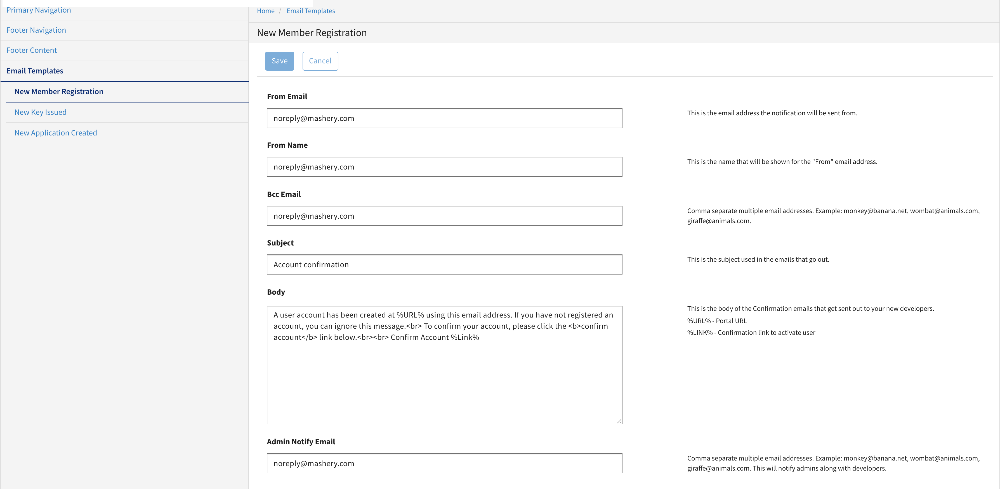

---
sidebar_position: 2
---

# Customizing Registration Email Body

<head>
  <meta name="guidename" content="API Management"/>
  <meta name="context" content="GUID-9712724d-a017-4e41-a786-00e6f742f2da"/>
</head>

Local Edition provides an option to customize the registration email body. 

## Procedure

To customize the email body: 

1. In the Configuration Manager window, click Portal Configuration. 

   The Primary Navigation window opens. 

2. Click the Email Templates tab and then click New Member Registration. 

3. In the New Member Registration window type the following: 

   - From Email 

   - From Name 

   - Bcc Email 
   
   - Subject

   - Body 

   - Admin Notify Email 

