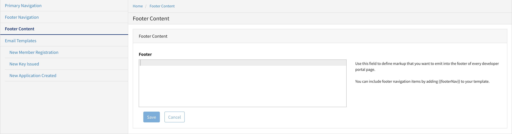

---
sidebar_position: 1
---

# Managing Portal Settings

<head>
  <meta name="guidename" content="API Management"/>
  <meta name="context" content="GUID-78fa5255-ccc1-422f-b3b5-33e4299e9991"/>
</head>

The **Portal Settings** page allows you to configure and manage settings for your Developer Portal. 

Use the **Footer** field to configure custom content for the footer that appears at the bottom of your Developer Portal pages. 

