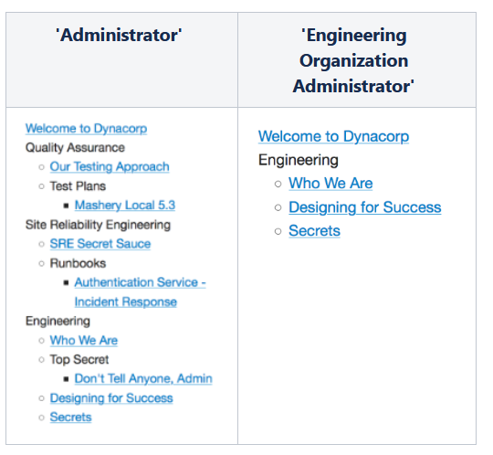

# Managing Organizations

<head>
  <meta name="guidename" content="API Management"/>
  <meta name="context" content="GUID-ebbba4d8-4fc0-484a-b976-bb7df480c88c"/>
</head>

One of the biggest challenges to implementing a least-privilege approach to API management assets is the need for a way to model your API assets' ownership in a way that makes sense for your business. To help you map your business into our management service, we have developed a new type of asset/entity into the Local Edition - 'Organizations'. Organizations are logical subdivisions of your overall deployment, a way for you to create an API asset management hierarchy that maps to organizations in your company. 

Any number of organizations can be created in your deployment, and each of those organizations can have any number of sub organizations. Those two levels of depth should allow you to model, at a high level, the structure of those teams operating inside of your deployment. The roles that are generated with each organization allows you to grant members of your deployment-specific, filtered access to only those assets that
they are entitled to manage based on their organization membership.

It is important to place API assets into the ownership of specific organizations where possible, as an important step in furthering a least-privilege model of security access. It also reduces the likelihood of
human error or unintentional changes when too many people have access to API assets that are irrelevant to their responsibilities, and reduces the number of information people need to sift through, by filtering the server response to only those assets relevant to the user.

## Creating Organizations

To create your first organization: 

1. Log in to the Configuration Manager application.

1. Click **Organizations** on the Configuration Manager welcome page. 

1. Click . 

1. Name and describe your organization, and indicate where in the hierarchy you want to place this organization by naming its parent node in the tree structure. 

1. Click . 

1. Create clean 'separations-of-concern' between your various API programs! Begin assigning ownership of API assets to organizations by assigning members to these organizations, creating content repositories for those organizations, and moving area-level API assets into smaller, more focused organizational groupings. 

## Assigning Organization Administration Roles

After defining an organization, you may notice that your area/deployment has some new roles available; these are provided to help you start filtering area members into specific organizations for the purpose of enabling management of organization-assigned assets. 

To view your currently-defined roles, click on **Portal Access Groups** on the Home page: 

You see a list of all the portal access groups you have available for role assignment: 

You can notice that you cannot modify the portal access groups created by the system, only those that you have defined yourself -- do not worry, this is intentional, as these are provided as a complement to organizations and each has specific implications in the context of this fast-growing application. Assigning the roles happens at the asset level -- let us look at a few of the places where these roles make a significant difference: 

- **API Definitions** - When you assign a portal access group to an API definition, you're stating a policy dictating that "...the bearer of this role has access to the Interactive Documentation for this service." This is how you educate people about an API, and let them interact with it (even if you are not necessarily letting them manage it). When an API definition has been made available to a particular portal access group, if it has a Swagger/OpenAPI specification associated with it in the Interactive Documentation management page. It is available in the Local Edition Developer Portal at the "/interactive-documentation" route.

- **Plans** - When you assign a portal access group to a Plan, you are stating a policy dictating that "...the bearer of this role has access to this plan, pursuant to the plan's own configuration - this is how you give people the ability to register for an API Key in your developer portal. When a Plan has been made available to a particular portal access group, it is available as a registerable API in the Application Registration, and add APIs to Application views of the developer portal.

- **Content** - When you assign a portal access group to a [Content Page](../Manage_configuration_data/Configure_the_CMS/Setting_advanced_options.md) in the [Content Management System](../Manage_configuration_data/Configure_the_CMS/Configuring_the_content_management_system.md), you're deciding who gets to navigate to and/or see that content in the developer portal - this is how you shape your content audiences and target-specific segments of your developer population (internal, or otherwise) with useful information. 

**Sub-Topic: Document Navigation**

The Document Navigation provided by default in the developer portal is effectively a site map that is established on a per-user basis per authenticated developer portal session. 

While an Administrator might see a tree in its entirety, if the Content Management System is sufficiently configured, a member of the 'Engineering' organization might only see a subtree of the total available content. 

## Capabilities

The following is an example of organization hierarchy. 

- **Organizational Role Inheritance** - The primary organizational role, provided at the time of organization creation, is 'Organization Administrator'. This indicates that the users possessing this role have the right to manage their team's/organization's API management assets - notably APIs/Endpoints, Packages/Plans, and content authored in the CMS. It is also important to note that in each of the three tiers of system-defined roles (area/deployment roles, 1st-tier organization roles and 2nd-tier/sub-organization roles), all roles propagate (are inherited) down the organization tree. In the sample organization structure above: 

  - Members possessing the area-level 'Administrator' role are inherently or explicitly become 'Organization Administrator' in all organizations defined in the deployment 

  - Members possessing the 'Research and Development' organization 'Organization Administrator' role are inherently or explicitly become 'Organization Administrator' for all its child organizations ('Engineering', 'Quality Assurance', and 'Site Reliability Engineering') 
  
  - members possessing the 'Organization Administrator' role in any leaf node of the organization tree have no rights to API management assets outside the scope of those assigned directly to the leaf-node organization ('Engineering', 'Accounts and Authentication' among others) 

The main point of this is to help you understand that **you do not need to** assign administrative roles at every level of the hierarchy - roles implicitly propagate down the tree to their lower-order equivalents. 

- **API Definitions** - [API Definitions](../Manage_configuration_data/Configuring_api_domains.md) are one of the key assets that can be assigned to an organization. When you first create your API/service (manually, imported from a Swagger/OpenAPI specification in a JSON file, or imported directly from a live hosted Swagger/OpenAPI specification ) you get a choice as to which organization manages this asset: 

  

  Simply indicate the organization you want to handle management of this API Definition - you can place this service anywhere in your area/deployment that makes logical sense for your business. After it has been placed in the custody of an organization, it ceases to be visible to other Dashboard users, unless they have the appropriate access (see [Organization Role Inheritance](../Manage_configuration_data/Managing_organizations.md)).

- **Packages** - Like API Definitions, Packages are critical for bundling the right APIs and endpoints together and distributing them to each developer community with a simple API Key. You may find yourself needing to consume another organization's services or even bundle them together with your own offering. With organizational structure in place, you can focus those cross-cutting decisions to the appropriate level by coordinating with an administrator in the organization that is their shared common 'ancestor' in the hierarchy (which may in fact be the area or deployment level itself) who can help create the cross-organization bundles for distribution to your API consumers. 

  When you create a Package you get an 'Organization' decision to make: 

  

  Indicate the organization you wish to manage at this level of bundling for services. Remember that you can't tie APIs from different organizations unless you have area/deployment 'Administrator' access, or you possess the correct roles to make both organizations visible to you. Here again, after the package has been assigned to an organization, it is invisible to members who lack appropriate access (see [Organization Role Inheritance](../Manage_configuration_data/Managing_organizations.md)). 

- **Content Pages** - Content Pages or even entire Folders (generally 'Content Objects') can be designated as assets that belong to a specific organization. It's a common pattern to give organizations control of their own Documentation repository, and we support this during content creation and after creation in the [Organization settings](../Manage_configuration_data/Configure_the_CMS/Setting_advanced_options.md) tab of the 'Advanced Options' configuration on each content object. 

  

## Role Based Access Control Matrix

The table below lists all the roles and their corresponding access to Menu options for the Configuration Manager:

