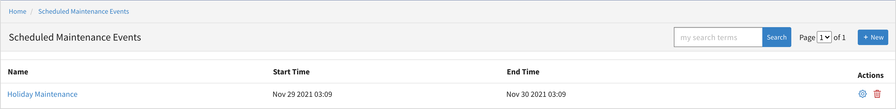
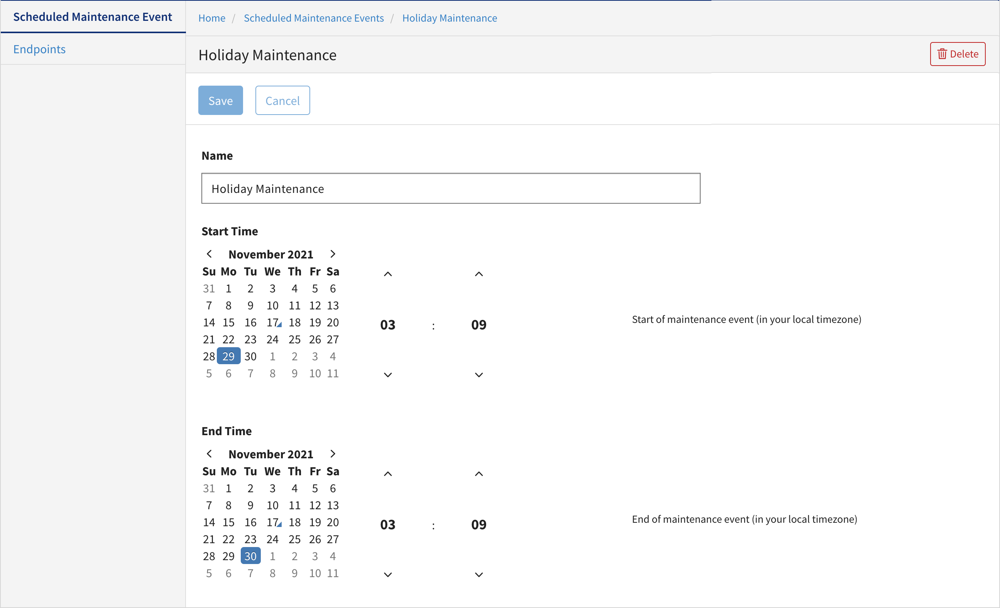
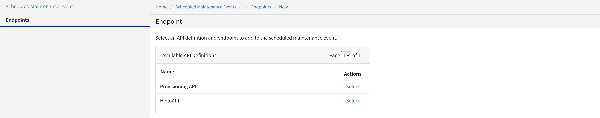

---
sidebar_position: 14
---

# Managing Schedule Maintenance Events

<head>
  <meta name="guidename" content="API Management"/>
  <meta name="context" content="GUID-e00287cf-b0e0-4b53-a238-b4b13b25f1a1"/>
</head>

