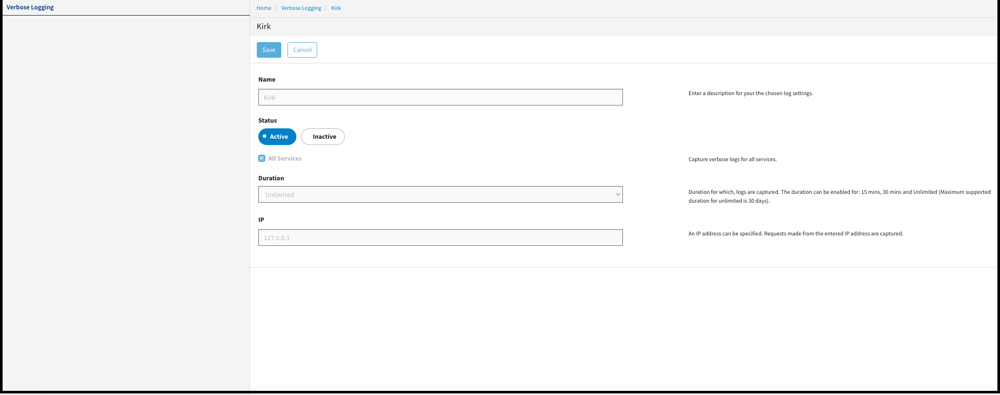

---
sidebar_position: 2
---

# Configuring Verbose Logging

<head>
  <meta name="guidename" content="API Management"/>
  <meta name="context" content="GUID-e8038a0b-8c43-4a41-bf0b-efa06e79f30a"/>
</head>

You can perform the following tasks for the verbose logging:

- Creating a verbose logging configuration

- Modifying an existing configuration

Consider the following points when configuring verbose logging:

- Multiple configurations for a pair of the same service-endpoint are not allowed.

- If a configuration is active for all services, then creation of a new configuration is not allowed.

- Once the duration time is over, the configuration is inactive.

- Only admin users can access the verbose logging.

- You can activate or deactivate the configuration.

## Creating a New Verbose Logging Configuration

## Procedure

1. On the **Verbose Logging** page, click **New**.

2. Fill in the following values. Click **Save**. 

   

   |Field|Description|
   | ---- | ---- |
   |Name|Name of the configuration.|
   |All Service|It enables you to consider logs for all the services.|
   |Service|It enables you to filter the logs for a selected service.|
   |Endpoint|It enables you to filter the logs for a selected endpoint.|
   |Api Key|Captures the logs for the associated API key.|
   |Duration|
It indicates the duration of logs captured in minutes. 

Unlimited duration keeps the verbose logging active for 30 days.
|
   |IP|It indicates requests made from the entered IP address are captured.|
   |Log Destination|Specify the URL of the tool that you configured to forward the logs.|

**Result**

A new configuration is created.

## Modifying an Existing Configuration

You can make an existing verbose logging configuration active or inactive.

