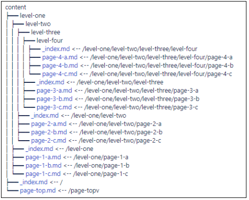

---
sidebar_position: 5
---

# Building your Developer Portal

<head>
  <meta name="guidename" content="API Management"/>
  <meta name="context" content="GUID-f1cb4f45-0ee9-4403-be20-c43a123cba99"/>
</head>

Local Edition Developer Portal pages are built with Hugo and we do make some assumptions: 

- You have [Hugo](https://gohugo.io/) installed on your machine.

- You have [Node.js](https://nodejs.org/en/) installed on your machine. 

- You have [GulpJS](https://gulpjs.com/) installed on your machine. 

## Folders

The codebase for the Developer Portal is included as a container that is part of the 5.2 (or later) installation files. 

Organize your site like any other Hugo project. (See the Organization topic at [Hugo](https://gohugo.io/content-management/).) Typically, you have a content folder with all your pages.

:::note

`_index.md` is required in each folder, it is your "folder home page". 

:::

## Building with Hugo

Use Hugo to build your HTML files. 

1. In the command line, cd into the directory for your project and run a build.

2. `gulp` compiles, lints, concatenates, and minifies all of the template files, and runs a fresh build of the Hugo templates. You can access them in the `docs` directory. 

3. `gulp` watch runs the default Gulp tasks, watch for the changes, and recompile automatically. 

4. `gulp server` runs the default Gulp tasks, automatically recompile when changes happen, and spin up a local development server that automatically reloads with your changes. 
