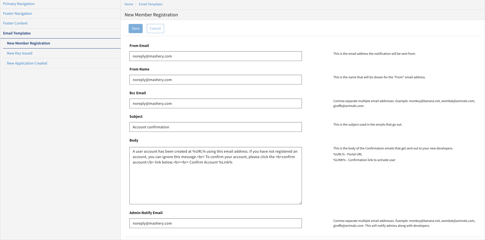

---
sidebar_position: 2
---

# Creating Custom Content for Footer

<head>
  <meta name="guidename" content="API Management"/>
  <meta name="context" content="GUID-5b8130bd-d833-4b41-b845-3c6e88b6c2f2"/>
</head>

Mashery Local provides an option to customize content for Privacy Policy, Terms of Use, Contact Us located in the footer of the developer portal. 

To customize the email body: 

1. In the **Configuration Manager** window, click **Portal Configuration**. 

   The **Custom Pages** window opens. 

2. Click **Email Templates** tab and then click **New Member Registration**. 

3. In the **New Member Registration** window type the following: 

   - From Email 

   - From Name 

   - Bcc Email 

   - Subject 

   - Body 

   - Admin Notify Email 

