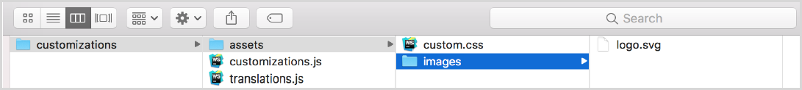

# Stage Portal Customization

<head>
  <meta name="guidename" content="API Management"/>
  <meta name="context" content="GUID-0bc095bf-0c35-4f6a-a3c6-68d1d5f52b7a"/>
</head>

Stage portal customization command is part of the cluster manager command-line interface (CLI) utility tool used for testing the cluster. 

## Before you begin

- A file named `customizations.js` is used for template customization and contains all the changes such as adding a logo, modifying the CSS, modifying the settings of the portal etc to be made. 

  ```xml
  // Load custom styles
  portal.loadCSS('/files/assets/custom.css');
  // Settings for logo
  portal.settings({logo: '<svg xmlns="http://www.w3.org/2000/svg" width="1em" height="1em"
  viewBox="0 0 16 16" aria-describedby="
  logo-title"><title id="logo-title">Acme Developer Portal</title><path fill="#272727"
  d="M15.781 12.953l-4.712-4.712a.752.752 0 0 0-
  1.061 0l-.354.354L6.779 5.72 11.499 1h-5l-2.22 2.22-.22-.22H2.998v1.061l.22.22-3.22 3.22
  2.5 2.5 3.22-3.22 2.875 2.875-.354.354a.
  752.752 0 0 0 0 1.061l4.712 4.712a.752.752 0 0 0 1.061 0l1.768-1.768a.752.752 0 0 0 0-
  1.061z"/></svg>'});
  ```

- A file named `ranslations.js` is used for translation customization and contains all the translations. 

  ```xml
  portal.addTranslations('ar', {
  footer: {
  copyright: `. ${new Date().getFullYear()} . `,
  'nav-privacy': ' ',
  'nav-terms': ' ',
  'nav-contact': ' '
  }
  }, true);
  portal.setLang('ar');
  ```

- Folder named assets contains an arbitrary hierarchy of folders with files in them or only files. These files can be served in the portal templates pages by using the Files API. 

  ```xml
  portal.addTranslations('ar', {
  footer: {
  copyright: `. ${new Date().getFullYear()} . `,
  'nav-privacy': ' ',
  'nav-terms': ' ',
  'nav-contact': ' '
  }
  }, true);
  portal.setLang('ar');
  ```

- A file named custom.css containing the styles required for customization. 

  ```
  /* Change the home page - hero content background */
  .single-_index .hero{
  background-image: linear-gradient(rgba(0, 0, 0, 0.3), rgba(0, 0, 0, 0.3)), url
  ("/files/assets/images/logo.svg");
  background-size: 385px 100%;
  }
  ```

## Result

The basic structure of the customization folder is as follows. 


