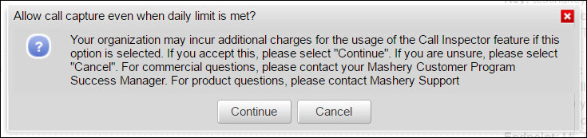

---
sidebar_position: 1
---

# Log Settings

<head>
  <meta name="guidename" content="API Management"/>
  <meta name="context" content="GUID-ed133bae-a582-4004-8a95-02d542670815"/>
</head>

Call capturing must be enabled for the calls to appear in the **Viewer** tab for call inspection. On the **Log Settings** tab, the settings to capture calls must be set. The **Log Settings** tab is available only to the Administrator and the Call Inspector Administrator roles. 

The following table describes the fields on the **Log Settings** tab. 

|**Field or Section** |**Description** |
| ----- | ----- |
|Select a duration|
Duration for which, calls are captured. Call log can be enabled for: 

- 15 minutes 

- 30 minutes 
|
|Allow call capture even when daily limit is met|
Allows capturing calls even after the daily limit of captured call data (example, 250 Mb) is used. Exceeding the daily service limit setting might cause you to incur additional charges. 

The following confirmation message is displayed when the check box is selected.

Calls can be captured up to the specified limit. 
|
|Enable Call Logging|
Enables call logging for the selected duration. 

After call logging is enabled, a countdown timer is displayed.

A similar notification is displayed on the [Viewer](../Viewer/Viewer.md) tab.
|
|Service|Select a Service, which then exposes the list of Endpoints. |
|Endpoint|
Call log includes calls for the selected endpoint. 

:::note

A single endpoint might be enabled for capture at any given time.

::: 
|
|Status Codes|
Calls with selected status codes are logged. 

:::note

All available status codes are considered for logging, if no status codes are selected.

::: 
|
|Key|Calls associated with entered Package key are logged. |
|IP Address|
Calls made from entered IP address are logged. 

:::note

All IP addresses are considered for logging, if no IP address is entered.

::: 
|
|Logging History|
Displays the history of the log settings created. The Logging History section displays the following details: 

- **Started By:** Name of the person that turned on the Call Capture setting. 

- **Date/Time:** Date and Time when the Call Capture was turned on. 

- **Duration:** Duration for which the Call Capture was turned on. 

- **Call Capture allowed over limit:** Displays whether or not call capture is allowed after daily limit is reached. 

- **Log Settings:** Settings used to turn on Call Capture. The Log Settings columns displays the following details: 

&emsp;&emsp;- **Status Code:** Displays the status codes selected for call capturing. If none of the status check boxes are selected, all status codes are considered for call capturing. 

&emsp;&emsp;- **IP Address:** An IP address can be specified. Calls made from the entered IP address are captured. 

&emsp;&emsp;- **Key:** Calls associated with entered Package key are captured. 

&emsp;&emsp;- **Service:** Displays the service names selected for call capturing. 

&emsp;&emsp;- **Endpoint:** Displays the endpoint name for the selected call captured.
|

