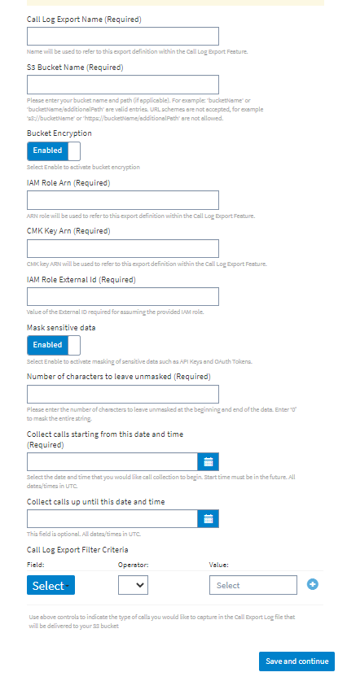
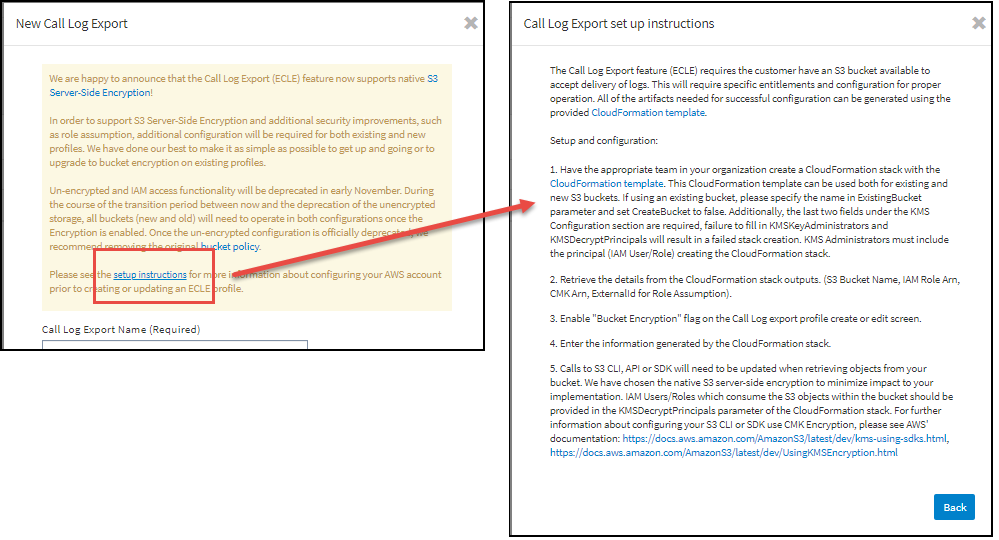
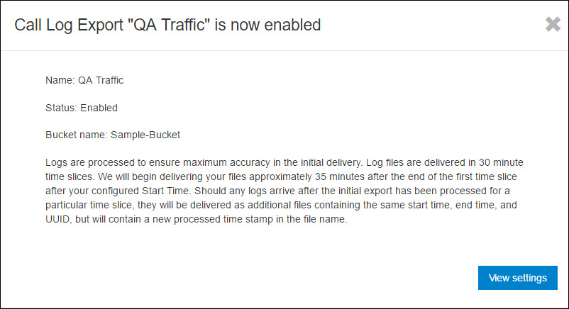

---
sidebar_position: 3
---

# Adding Call Log Export Profiles

<head>
  <meta name="guidename" content="API Management"/>
  <meta name="context" content="GUID-89878d97-5820-40c0-852b-46b0438e6368"/>
</head>

## Procedure

To add a Call Log Export profile: 

1. Click **Analyze > Call Log Exports**. 

   The **Manage your Call Log Exports** page is displayed. 

2. On the **All Call Log Exports** page, click **New Call Log Export**. 

   The **New Call Log Expor**t window is displayed. 

   

3. On the **New Call Log Export** window, enter the following details. 

   |**Field** |**Description** |
   | ----- | ---- |
   |Call Log Export Name|
(Required) Name for new Call Log Export profile. 

Can contain spaces, special characters, and alphanumeric data. 

This name could indicate the type of configuration, for example, Test Call Log Export, Test\_Call\_Log\_Export, or Call-Export-1. 

:::note

Once the configuration is saved, this field can be edited later. Value must be unique.

::: 
|
   |S3 Bucket Name|
(Required) Enter your bucket name and path (if applicable). For example: 'bucketName' or 'bucketName/additionalPath' are valid entries. URL schemes are not accepted, for example 's3://bucketName' or `https://bucketName/additionalPath` are not allowed. 

Click the setup instructions link for more information about configuring your AWS account prior to creating or updating an ECLE profile.

|
   |Bucket Encryption|
Select **Enable** to activate bucket encryption. Enter the following criteria: 

- **IAM Role Arn** - used to refer to this export definition within the Call Log Export feature. 

- **CMK Key Arn** - used to refer to this export definition within the Call Log Export feature. 

- **IAM Role External Id** - required for assuming the provided IAM role. 
|
   |Mask sensitive data|Select **Enable** to activate masking of sensitive data, such as API keys or OAuth tokens. |
   |Number of characters to leave unmasked |
The number of characters that are shown at the beginning and the end of the data. Valid values: 0 - 127. Using 0 masks the entire string. 

For example, if the number of characters to leave unmasked is 3, and the data value is 0123456789, the resulting value is shown as 012\*\*\*\*789. 
|
   |Collect calls starting from this date and time|
(Required) The date and time for data collection to begin. 

Future date/time required. Call log export start date and time snap to the near hour mark. 

For example: 

2017-03-21T06:57:00.000+000 snaps to 2017-03-21T07:00:00.000+000

:::note

Once the configuration is saved, this field cannot be edited.

::: 
|
   |Collect calls up until this date and time|
(Optional) The date and time for data collection to stop. 

Any future date is allowed, provided it is later than the start date. No end date results in the export running until the profile is disabled or deleted. 

:::note

Once the configuration is saved, this field cannot be edited.

 
|
   |Call Log Export Filter Criteria|
Indicates the type of calls to capture in the Call Log Export log file that is delivered to your S3 bucket. Specify the following criteria: 

- **Field** - API Definition, API Key, or Response Code. 

- **Operator **- is or is not. 

- **Value** - enter the desired value, then press +. 
|

4. Click **Save and continue**. 

   The Call log filter criteria window is displayed.

5. (Optional) If no filters are set, all data is included in the export. Should you want to filter data, either by explicitly excluding or explicitly including, you might use the **Call log filter** criteria window: 

   **Field:** In the **Select** list, specify any of the following: 

   |**Filter** |**Description** |
   | --- | --- |
   |API Definition|Name of an API configured within . Includes type-ahead feature. |
   |API Key|API Key of consumer of your APIs. Free entry. |
   |Response Code|HTTP Response code (ex. 200,400,500, etc). Drop down list. |

   **Operator:** Specify is or is not. 

  **Value:** Depending on the Field selected, use the list to specify the value.

6. Click **Add** to add the filter criteria. The added filter criteria is displayed at the bottom of the window. You can add additional filters as needed on this screen but you will not be able to edit filters once a profile has been created. 

   :::note
   
   If you use an is logic filter in your first filter within a particular field type, you can only create additional is logic filters. If you use an is not logic filter in your first filter within a particular field type, you can only create additional is not logic filters. You cannot create both is and is not logic filters within a field type, though you can use differing operators in different field types. For example, you can use is on the **API Key** field and is not on the **Response Code** field. When using multiple field types in a filter, the **And** operator is used in the filter across field types. 

   :::

7. When finished, click **Save and continue**. The **Call Log Export "name" is now enabled** window is displayed.

   

8. Click View settings or Close to return to the Settings page. 

## Result

Once the Call Log Export profile is configured and enabled, Control Center generates the raw call logs and exports them as .gz files into the Amazon S3 bucket. The customer can then export the data to Boomi Spotfire, Splunk or other database/business intelligence software for further analysis. **It might take up to 2.5 hours for your first export to arrive in your S3 bucket.**

