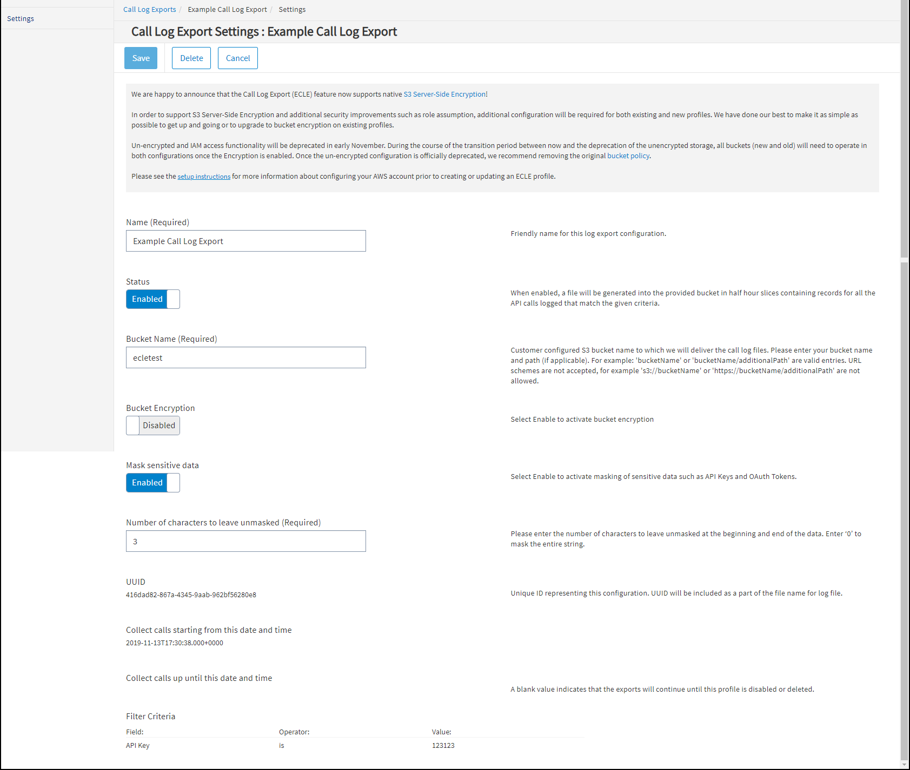
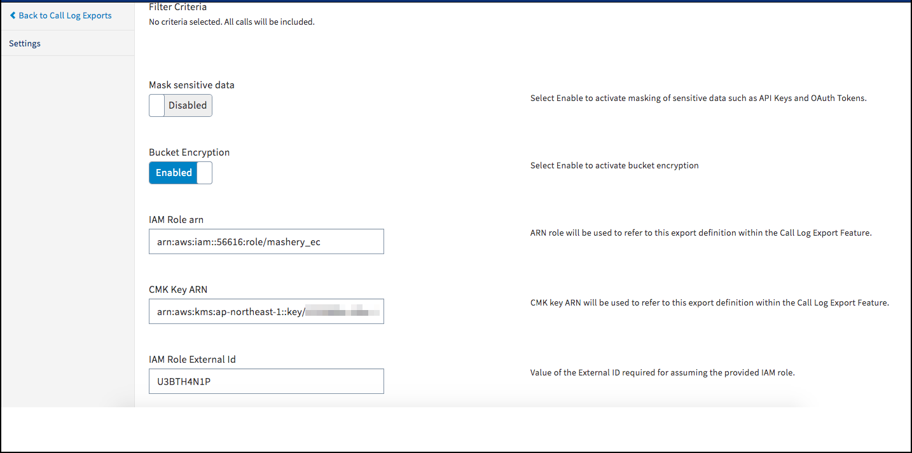

---
sidebar_position: 2
---

# Call Log Export Setting

<head>
  <meta name="guidename" content="API Management"/>
  <meta name="context" content="GUID-d1a70134-4990-483d-8f49-214482d00711"/>
</head>

General settings such as name, status, bucket name, bucket encryption, UUID, filter criteria, and sensitive data masking can be defined on the **Call Log Export Setting** page.

The following table describes the fields on the Call Log Export Setting page. 

|**Field** |**Description** |
| ---- | ---- |
|Name|Name for the **Call Log Export** configuration. Required. |
|Status|When enabled, generates a file into the provided bucket in half-hour increments, which contain records for all the API calls logged that match the settings defined in **Filter Criteria**. |
|Bucket Name|The Customer's Amazon S3 bucket name to which the call log files are delivered to. |
|Bucket Encryption|
Provides native S3 server-side encryption for the bucket. To configure bucket encryption, use the provided [Cloud API Management Formation](https://developer.mashery.com/files/ECLE_customer_resources.yaml) template mentioned in the **Call Log Export setup instructions** available in the **New Call Log Export** workflow. 

When enabled, specify the following criteria: 

- **IAM Role Arn** - used to refer to this export definition within the Call Log Export feature. 

- **CMK Key Arn** - used to refer to this export definition within the Call Log Export feature. 

- **IAM Role External Id** - required for assuming the provided IAM role. 
|
|Mask sensitive data|Select Enable to activate masking of sensitive data, such as API keys or OAuth tokens. |
|Number of characters to leave unmasked |
The number of characters that are shown at the beginning and the end of the data. Valid values: 0 - 127. Using 0 masks the entire string. 

For example, if the number of characters to leave unmasked is 3, and the data value is 0123456789, the resulting value is shown as 012\*\*\*678. 
|
|UUID|Unique ID for the **Call Log Export** configuration. The UUID is included as part of the file name for the log file generated (when the Status setting is Enabled). |
|Collect calls starting from this date and time|
(Required) The date and time for data collection to begin. 

Future date/time required. Call log export start date and time snaps to the near hour mark. 

For example: 

2017-03-21T06:57:00.000+000 snaps to 2017-03-21T07:00:00.000+000

:::note

Once the configuration is saved, this field cannot be edited.

::: 
|
|Collect calls up until this date and time|
(Optional) The date and time for data collection to stop. 

Any future date is allowed, provided it is later than the start date. No end date results in the export running until the profile is disabled or deleted. 

:::note

Once the configuration is saved, this field cannot be edited.

::: 
|
|Filter Criteria|
Indicates the type of calls to capture in the Call Log Export log file that is delivered to your S3 bucket. Specify the following criteria: 

- **Field** - API Definition, API Key, or Response Code. 

- **Operator** - is or is not. 

- **Value** - enter the desired value, then press +. 
|

