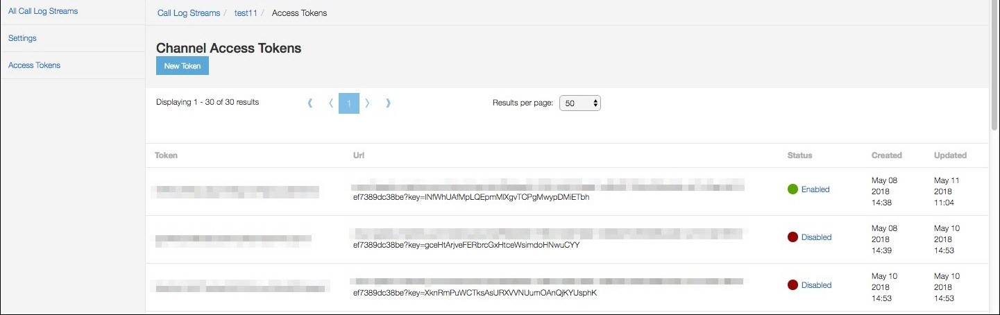

---
sidebar_position: 4
---

# Call Log Stream Access Tokens

<head>
  <meta name="guidename" content="API Management"/>
  <meta name="context" content="GUID-4babcd7a-8ef8-4a18-8246-9c8deead2689"/>
</head>

Click **Access Tokens** in the left pane to open the **Access Tokens** page. The Access Tokens page is used to manage or create tokens for a channel. Only one token can be enabled at a time. To enable a token, other tokens must be disabled.

Click **New Token** to generate a new token. 

The following table describes the fields displayed on the **Access Tokens** page. 

|**Column Name** |**Description** |
| ---- | --- |
|Token|Lists the token ID. |
|URL|The WebSocket URL created at the time the token is created. |
|Status|The status of the token, either **Enabled** or **Disabled**. |
|Created|The date and time when the token was created. |
|Updated|The date and time when the token was last updated. |

