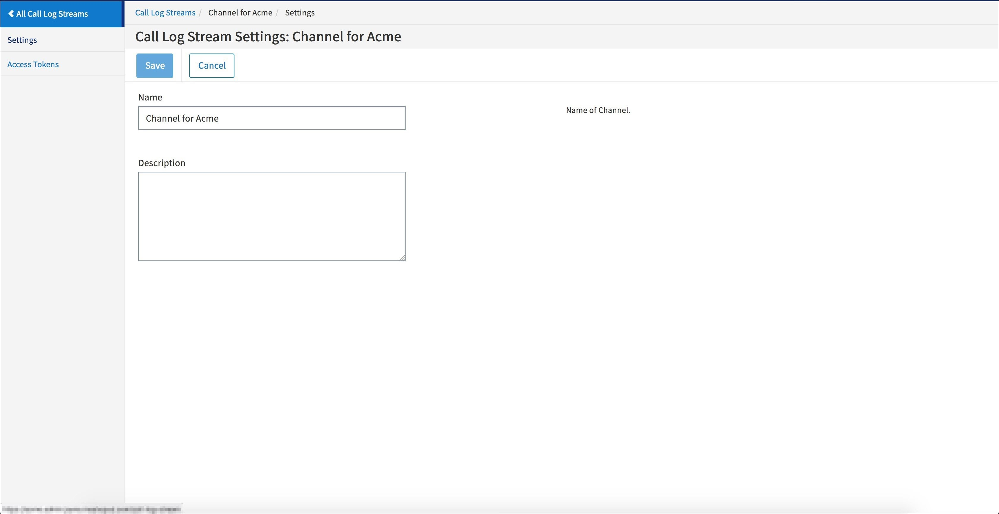

---
sidebar_position: 3
---

# Call Log Stream Settings

<head>
  <meta name="guidename" content="API Management"/>
  <meta name="context" content="GUID-fbe0e834-e978-4fd9-bdfc-05eb8141a196"/>
</head>

Click the **Settings** tab in the left pane to view or modify the settings for a Channel.

View or modify the information listed in the following table: 

|**Field Name** |**Description** |
| ---- | ---- |
|Name|The name for your channel. |
|Description|The description for the channel (optional). |

