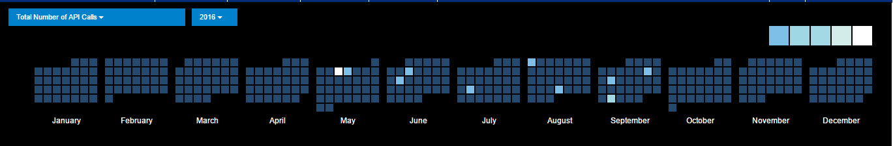
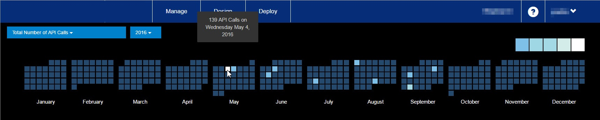

---
sidebar_position: 2
---

# Calendar Heat Map

<head>
  <meta name="guidename" content="API Management"/>
  <meta name="context" content="GUID-168d35cb-b702-4b2a-8f18-9403b4446106"/>
</head>

The Calendar Heat Map is a visualization that displays the time-based activity patterns of a particular metric over the course of a selected year. Each day is color-coded with respect to the corresponding metric value, and users can interactively highlight a specific day. 

For example, let us assume that an API Product Manager wants to quickly observe and share the Total Number of API Calls per day over the course of a particular year. So, a screenshot taken with the color-coded legend can efficiently share the behavior and trend. 

## Legend

The Legend segments depict the metric value using color. A smaller metric value contains more blue color and visually blends into the background. The larger metric value contains more white color and is visually easier to detect because this contrasts with the background.

## To view the Summary signal details

1. Select a metric and a year in the two lists, which are at the upper-left corner of the Calendar Heat Map. 

   The Calendar Heat Map is populated for all the days of all the months for the selected metric and year. For each day, the metric is used to color-code each day according to the segments of the color legend. 

1. Point to a single block in the Calendar Heat Map representing a particular day. 

   A tool tip displays the date, day, and details about the signal on that particular day. 

   For example, the tool tip in the following screenshot informs the following: 

   - Day: Wednesday 

   - Date: May 4, 2016 

   - The total number of API Calls for the sample API program: 139 

Of the two lists, the leftmost list has the following signals: 

|**Signal** |**Description** |
| ---- | ----- |
|Total number of API Calls|Total number of API calls for the selected period. |
|API Platform Status|Ratio of the summation of API calls with a status code of either 503 or 504 divided by the total number of API calls for the selected period. |
|Platform availability|Defined as one minus the API platform status metric displayed as a percentage for the selected period expressed as a percentage for the selected period. |
|QPS (max)|The maximum of the measured calls per second rate for the API platform for the selected period. |
|QPS (95th)|The 95th percentile of the measured calls per second rate for the API platform for the selected period. |
|Data Served|The quantity of data served through the API platform in units of bytes for the selected period. |

