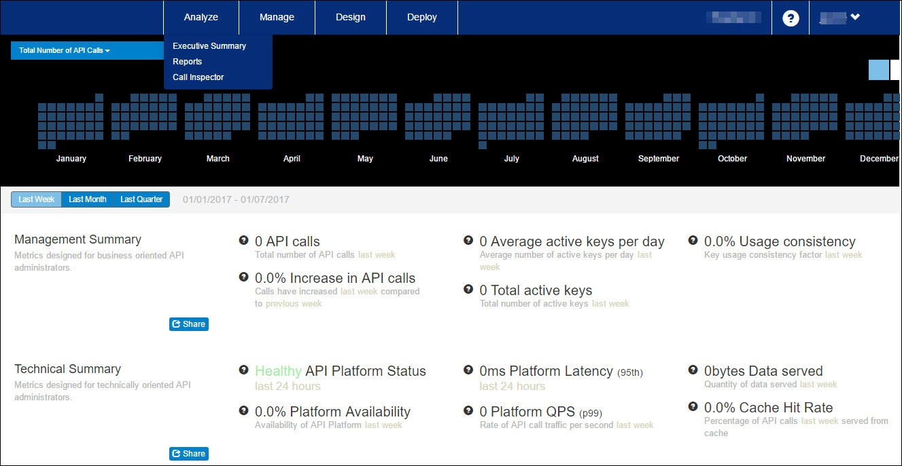

---
sidebar_position: 1
---

# Executive Summary

<head>
  <meta name="guidename" content="API Management"/>
  <meta name="context" content="GUID-6e37536c-af31-4721-b07e-4149c4797f07"/>
</head>

The **Executive Summary** page provides a high-level view of your Application Programming Interface (API) program with new analytic metrics and trends in an easy-to-share format for executive stakeholder audiences throughout your organization. To access the **Executive Summary** page, go to **Analyze > Executive Summary**. 

The Executive Summary is designed to deliver a comprehensive suite of insights quickly and efficiently without any data collection and analysis tasks required. The Executive Summary is a complement to the existing reports also available on the administration dashboard and is designed for a wide audience such as API Administrators, API Product Managers, Business Development and Marketing Executives, and Technical Executive leadership. 

The **Executive Summary** page is divided into two sections: 

- [Calendar Heat Map](./Calendar_heat_map.md)

- [Summary Insights Groups](./Summary_insights_groups.md)

:::note

The summary data displayed in both sections is independent of each other. 

:::
